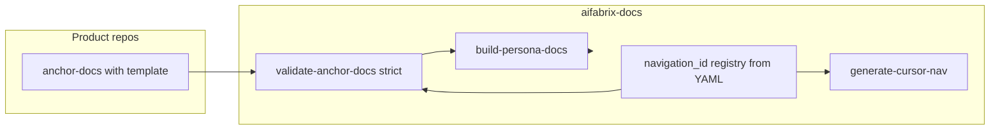

# YAML-first navigation + per-repo `anchor-docs/` (Cursor-executable)

## Split of responsibilities

| Layer | Location | Audience | Maintainers |
|-------|-----------|----------|-------------|
| **Site navigation + persona docs** | [aifabrix-docs](aifabrix-docs) `docs/`, YAML, Jekyll | Personas (end user, integrator, architect) | Generated + edited thin layer |
| **Technical anchors** | `anchor-docs/` in **dataplane**, **miso**, **builder** | Developers, AI | Repo teams; **mandatory template** |

Persona layer stays **thin**: summaries and links; **no** full schema dumps or CLI encyclopedia—those live in anchors and code.



---

## 1. Mandatory anchor doc template

**Every** `anchor-docs/**/*.md` (except an explicitly exempt `README.md` if you choose) must follow:

```md
---
title: <Title>
navigation_id: <nav.id>
owner: <team>
last_verified_commit: <sha>
---

## Summary
<short description>

## Details
<technical content>

## Examples
<commands / flows>

## Paths
[path:repo/path/to/file]
```

**Implementation:**

- Store a **copy-paste template** in each repo as `anchor-docs/_TEMPLATE` (**no `.md` extension**) so it is not part of `anchor-docs/**/*.md` while every real `*.md` (except exempt `README.md`) is validated. Alternatively one shared copy documented in aifabrix-docs.
- **Cursor rule (product repos):** when creating new anchor files, copy `_TEMPLATE` to `something.md` and apply the mandatory sections.

---

## 2. Path markers: `[path:...]` only (no backtick paths)

- All workspace-root-relative file references use **`[path:aifabrix-dataplane/openapi/openapi.yaml]`** (single line per marker or grouped under `## Paths`).
- **Cursor rule:** if user pastes `` `aifabrix-.../...` `` as a file reference, **suggest** conversion to `[path:...]`.
- **validate-anchor-docs** parses `[path:...]` only (not generic backticks)—keeps parsing strict and predictable.

---

## 3. `navigation_id` registry and mapping enforcement

- **Canonical list** of valid `navigation_id` values must come from **aifabrix-docs YAML** (generated extract from `docs/**/navigation.yaml` + section metadata, or maintained `config/navigation-ids.yml` that stays in sync with YAML).
- **validate-anchor-docs / coverage (strict CI):**
  - Every registered `navigation_id` has **≥1** anchor-doc across the three repos (policy: which IDs require anchors can be phased—initially **warn**, then **fail**).
  - **No orphan** anchor-docs: every `navigation_id` in frontmatter exists in the registry.
- **Cursor task:** run coverage report; output **missing** sections (no anchor) and **orphan** anchors.

---

## 4. Workspace config resolver (shared utility)

- **File:** [aifabrix-docs/scripts/config/workspace-root.yml](aifabrix-docs/scripts/config/workspace-root.yml) (example):

```yaml
aifabrix-work: /home/dev02/workspace
repos:
  dataplane: aifabrix-dataplane
  miso: aifabrix-miso
  builder: aifabrix-builder
```

- **Resolver:** load YAML, override with **`AIFABRIX_WORK`** env; export `getWorkspaceRoot()`, `resolveRepoPath('[path:...]')` for all scripts.
- **Single module** imported by `validate-anchor-docs`, `build-persona-docs`, coverage, golden-path (e.g. `scripts/lib/workspace-root.ts`).

---

## 5. Script: `validate-anchor-docs.ts` (strict mode, CI)

**Checks (fail on error in CI):**

1. Parse frontmatter: **`navigation_id`**, **`owner`** present; recommend **`last_verified_commit`** (warn if missing until rollout complete).
2. Body contains **`## Summary`** (non-empty).
3. At least one **`[path:...]`**; resolve via workspace root; **file must exist**.
4. **`navigation_id`** exists in **registry** derived from docs YAML.
5. Optional: **`owner`** matches allowed list in config (team registry).

**No backtick path resolution** in v1—enforces `[path:...]` convention.

---

## 6. Script: `build-persona-docs.ts` (required)

**Input:** scan `anchor-docs/**/*.md` under each repo (paths from workspace-root config).

**Logic:**

- Read frontmatter + **`## Summary`** + collect **`[path:...]`** for “source of truth” link block.
- **Map** `navigation_id` → target persona page(s) under `docs/` (configurable map: one persona file per id or grouped).
- **Output:** update or create **thin** Jekyll-facing markdown (and companion `.yaml` metadata if required by [merge-metadata](aifabrix-docs/scripts/merge-metadata.ts)): include **summary**, **link to anchor-doc** (relative path from docs repo to workspace or GitHub URL pattern—decide in implementation), **do not** duplicate full schema/CLI.

**Change detection (incremental regen):**

- Maintain a **cache** (e.g. `.cache/anchor-hashes.json` in aifabrix-docs, gitignored) of **per-anchor content hash**.
- If anchor unchanged, **skip** regenerating that persona section/file (or only touch timestamp if needed).

---

## 7. Script: `generate-cursor-nav` + `docs-sync`

- **`npm run generate-cursor-nav`:** read YAML under `docs/`; **always overwrite** [.cursor/Navigation.md](aifabrix-docs/.cursor/Navigation.md); banner: do not edit by hand.
- **`npm run docs-sync` (single entry):**
  1. `validate-anchor-docs` (strict)
  2. `build-persona-docs`
  3. `generate-cursor-nav`

Optionally invoke `docs-sync` or validate from [build-docs.ts](aifabrix-docs/scripts/build-docs.ts) when `AIFABRIX_WORK` is set (CI); skip or warn locally if workspace missing.

---

## 8. Cursor rules (aifabrix-docs + product repos)

| Rule | Intent |
|------|--------|
| **anchor-docs structure** (dataplane/miso/builder) | On edit `anchor-docs/*.md`: ensure `navigation_id`, `## Summary`, ≥1 `[path:...]`; suggest fixes if missing. |
| **Path style** | Prefer `[path:...]` over backticks for repo paths. |
| **Thin persona docs** (aifabrix-docs) | Do not paste full OpenAPI/schema/CLI reference into `docs/`; link to anchor-docs or generated summary block. |

---

## 9. Coverage check

- Part of **`validate-anchor-docs --coverage`** or separate **`npm run anchor-coverage`**:
  - List all registry `navigation_id`s with **anchor count**.
  - Exit **non-zero** if required IDs have zero anchors (config which IDs are required per phase).

---

## 10. Owner-based review (process + Cursor)

- **Convention:** PRs that change `anchor-docs/` should reference **`owner`** frontmatter (team/person).
- **Cursor suggestion:** remind author to add **PR label** or request review from owning team (full GitHub auto-assignment is optional automation).
- Document in **CONTRIBUTING** or anchor-docs README.

---

## 11. Golden path generator (follow-on)

- **Cursor/script action:** read **CIP + CLI** anchor-docs (by `navigation_id` or filename convention); emit **Create First Integration** persona page (or section) into `docs/builder/` with links back to anchors.
- Runs after base `build-persona-docs` is stable.

---

## 12. AI summarization hook (optional)

- **Input:** anchor-doc path.
- **Output:** shortened Summary; optional **developer** vs **architect** variants stored in frontmatter or sidecar—**only** if you want multi-persona from one anchor; otherwise `build-persona-docs` uses single Summary.

---

## Navigation story (docs repo)

1. **Canonical site nav:** YAML in `docs/<section>/` + [generate-navigation.ts](aifabrix-docs/scripts/generate-navigation.ts) / [generate-main-navigation.ts](aifabrix-docs/scripts/generate-main-navigation.ts).
2. **`.cursor/Navigation.md`:** generated only; **`npm run generate-cursor-nav`**.
3. **`navigation_id`:** bridges anchors ↔ nav registry ↔ persona outputs.

---

## Suggested `anchor-docs/` file sets (5–10 per repo)

(Unchanged from prior plan—each file uses the **mandatory template** and a distinct **`navigation_id`**.)

**Builder:** e.g. `cli-and-authentication.md`, `configuration-schemas.md`, `cip-and-pipeline-structure.md`, …  
**Miso:** `controller-overview.md`, `identity-and-keycloak.md`, …  
**Dataplane:** `openapi-and-api-truth.md`, `cip-execution-runtime.md`, …

`README.md` may list index and conventions; either full template or exempt with explicit note in validator.

---

## Success criteria

- All anchor files match **template**; CI **`validate-anchor-docs`** passes with **`[path:...]`** resolution.
- **Registry coverage:** no orphan `navigation_id`; required nav IDs covered (per phased policy).
- **`npm run docs-sync`** runs validate → persona build → cursor nav.
- **Persona docs** remain **thin** (summary + link); schemas/CLI truth stay in repos + anchors.
- **Cursor rules** exist for anchor structure, path markers, and thin docs.

---

## Relationship to knowledgebase / consolidation

- **`anchor-docs`** supersede ad-hoc **knowledgebase** for technical truth; legacy KB can point to anchors until removed.
- Ownership matrix rows should cite **`navigation_id`** + anchor file path.
