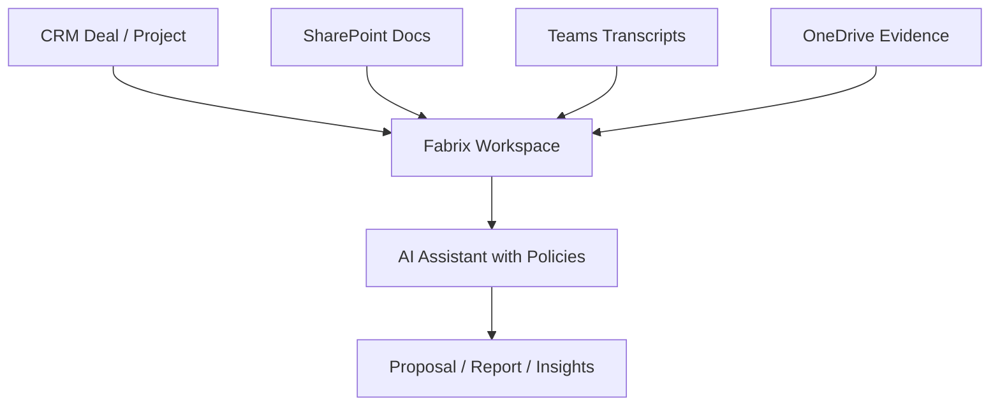

# Sales & Project Workspaces

AI Fabrix empowers sales and delivery teams with **workspace assistants** that bring together documents, transcripts, and evidence into a single governed environment.
By linking to CRM data, every workspace becomes **contextual, policy-aware, and collaborative**, helping teams accelerate deal cycles and execute projects with greater efficiency.

## Table of Contents

1. [Key Capabilities](#key-capabilities)
2. [Enterprise Value](#enterprise-value)
3. [Example Use Cases](#example-use-cases)
4. [Diagram: Sales & Project Workspaces](#diagram-sales--project-workspaces)

## Key Capabilities

- **CRM-Integrated Workspaces**
  Connect HubSpot, Dynamics, or Salesforce deals/projects directly to Fabrix workspaces.

- **Unified Evidence View**
  Aggregate SharePoint files, Teams meeting transcripts, and project documentation into one assistant-driven workspace.

- **Metadata Enrichment**
  Each workspace inherits metadata such as customer name, deal ID, or project classification to refine retrieval and enforce policies.

- **Policy-Aware Collaboration**
  Governance rules and access policies apply automatically to all workspace interactions.

## Enterprise Value

- **Accelerate sales cycles**: Teams can prepare business cases and proposals with all evidence in one place.
- **Improve project execution**: Delivery teams gain faster insights by connecting transcripts, documents, and structured project data.
- **Reduce risk**: Workspaces respect permissions and compliance, preventing accidental data exposure.
- **Boost ROI**: Aligns AI with revenue-driving processes instead of isolated productivity tools.

## Example Use Cases

- **Sales**: A deal workspace assistant that aggregates CRM data, customer documents, and prior meeting notes to prepare proposals.
- **Project Delivery**: A project assistant that helps track requirements, risks, and customer updates across SharePoint and Teams.
- **Account Management**: Ongoing customer workspace enriched with past case evidence, accessible only to the right team members.

## Diagram: Sales & Project Workspaces

Fabrix turns workspaces into **intelligent, compliant assistants** that not only gather information but also respect enterprise governance.
