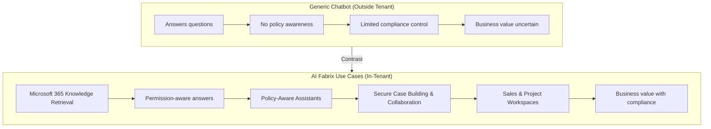
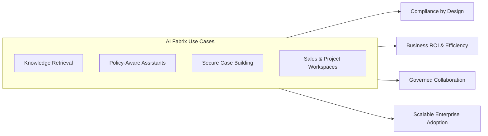

# Use Cases

AI Fabrix enables enterprises to build secure, policy-aware AI solutions on top of Microsoft services. Its in-tenant design, metadata-aware retrieval, and governance features make it ideal for scenarios where compliance and business value must go hand in hand.

## Table of Contents

1. [Microsoft 365 Knowledge Retrieval](microsoft-365-knowledge-retrieval.md)
2. [Policy-Aware Assistants](policy-aware-assistants.md)
3. [Secure Case Building & Collaboration](secure-case-building-collaboration.md)
4. [Sales & Project Workspaces](sales-project-workspaces.md)

## Microsoft 365 Knowledge Retrieval

Fabrix integrates with SharePoint, Teams, and OneDrive to deliver **permission-aware retrieval**. Users only access the documents and messages they are entitled to, reducing compliance risks.

This allows organizations to create internal knowledge assistants that scale across departments while maintaining security and access integrity.

## Policy-Aware Assistants

Unlike generic chatbots, Fabrix enables the creation of **assistants with built-in policy enforcement**. These assistants apply enterprise rules to every interaction, ensuring outputs comply with governance, security, and regulatory standards.

They are particularly valuable in regulated industries such as finance, healthcare, and the public sector.

## Secure Case Building & Collaboration

OpenWebUI provides a space for teams to **build cases collaboratively**. Users can attach evidence from SharePoint, Teams, CRM, or ERP systems, while Fabrix enforces audit logging and access controls.

This turns conversational AI into a secure workspace for compliance-driven processes like investigations, audits, and legal reviews.

## Sales & Project Workspaces

Fabrix can support sales and delivery teams by creating **workspace assistants** linked to deals or projects. These workspaces aggregate documents, meeting transcripts, and evidence, making it easier to collaborate and prepare business cases.

Integration with CRM systems ensures that AI-powered insights are contextualized and policy-aware.

## Generic Chatbots vs. Fabrix Use Cases

This diagram shows the contrast:

- **Generic chatbots** answer questions but lack governance, policy, or compliance guarantees.
- **Fabrix use cases** are structured, governed, and directly tied to enterprise processes.

## Use Cases — Summary & Enterprise Outcomes

AI Fabrix extends Microsoft 365 and Azure with **enterprise-ready AI use cases** that are secure, policy-aware, and directly tied to business outcomes.
By combining **metadata-aware retrieval, governance enforcement, and collaborative workspaces**, Fabrix moves AI adoption beyond pilots and into **production-grade solutions**.

### Recap of Core Use Cases

1. **Microsoft 365 Knowledge Retrieval**

   - Securely query SharePoint, Teams, and OneDrive with **permission-aware retrieval**.
   - Reduce compliance risk while improving knowledge access.

2. **Policy-Aware Assistants**

   - Apply **governance and regulatory rules** to every AI interaction.
   - Enable adoption in regulated industries like finance, healthcare, and public sector.

3. **Secure Case Building & Collaboration**

   - Build cases with evidence, audit trails, and access control.
   - Transform AI into a **compliance-ready workspace** for audits, legal, and investigations.

4. **Sales & Project Workspaces**

   - Link CRM deals or projects with M365 content and transcripts.
   - Accelerate business outcomes with **policy-aware, contextual AI assistants**.

### Enterprise Outcomes

- **Compliance by Design**: No data leakage, permission misuse, or uncontrolled retrieval.
- **Stronger ROI**: AI assistants aligned to revenue, compliance, and project delivery.
- **Governed Collaboration**: Teams work confidently knowing every step is logged and secured.
- **Scalable Adoption**: Enterprises can deploy AI across departments without sacrificing control.

### Diagram: AI Fabrix Use Case Outcomes

AI Fabrix ensures that **every use case drives measurable business value** while maintaining the highest standards of compliance and governance.

## Conclusion

Fabrix use cases go beyond simple chatbots. By combining secure retrieval, governance, and collaboration, Fabrix supports enterprise-ready AI solutions across knowledge management, compliance, and business operations.
