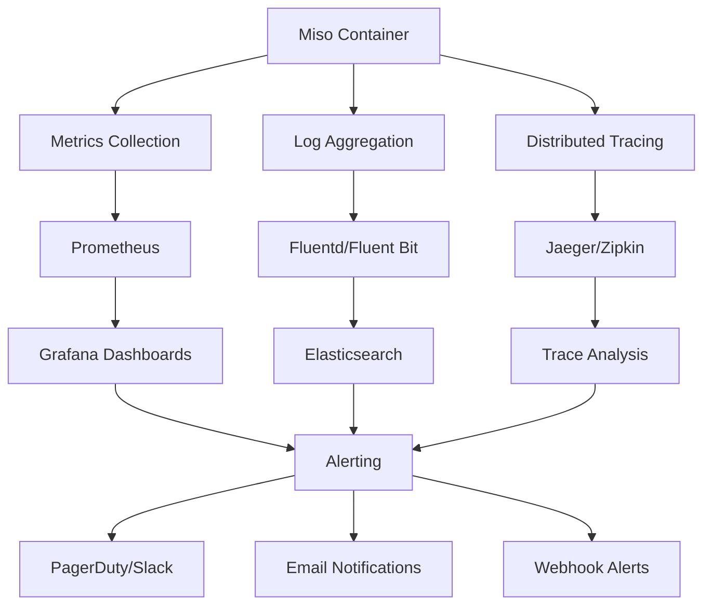

# Miso Container Monitoring & Logging

## Overview

This guide covers comprehensive monitoring and logging strategies for the Miso container, including metrics collection, log aggregation, alerting, and observability best practices.

## Monitoring Architecture

### Observability Stack



## Metrics Collection

### Prometheus Metrics

The Miso container exposes comprehensive metrics for monitoring:

#### Application Metrics

```bash
# HTTP Request Metrics
http_requests_total{method="GET",endpoint="/api/v1/applications",status="200"}
http_request_duration_seconds{method="GET",endpoint="/api/v1/applications",quantile="0.5"}
http_request_duration_seconds{method="GET",endpoint="/api/v1/applications",quantile="0.95"}
http_request_duration_seconds{method="GET",endpoint="/api/v1/applications",quantile="0.99"}

# Business Logic Metrics
miso_applications_total{status="active"}
miso_deployments_total{environment="production",status="success"}
miso_deployments_total{environment="production",status="failed"}
miso_users_total{role="admin"}
miso_users_total{role="developer"}
miso_users_total{role="viewer"}

# Performance Metrics
miso_memory_usage_bytes
miso_cpu_usage_percent
miso_disk_usage_bytes
miso_network_bytes_sent
miso_network_bytes_received
```

#### Infrastructure Metrics

```bash
# Container Metrics
container_memory_usage_bytes{name="miso-controller"}
container_cpu_usage_seconds_total{name="miso-controller"}
container_network_receive_bytes_total{name="miso-controller"}
container_network_transmit_bytes_total{name="miso-controller"}

# Database Metrics
postgres_connections_active
postgres_connections_idle
postgres_queries_per_second
postgres_query_duration_seconds
postgres_database_size_bytes

# Cache Metrics
redis_connected_clients
redis_used_memory_bytes
redis_keyspace_hits_total
redis_keyspace_misses_total
redis_commands_processed_total
```

### Metrics Configuration

```bash
# Prometheus Configuration
PROMETHEUS_ENABLED=true
PROMETHEUS_PORT=9090
PROMETHEUS_PATH=/metrics
PROMETHEUS_INTERVAL=15s
PROMETHEUS_TIMEOUT=10s

# Custom Metrics
CUSTOM_METRICS_ENABLED=true
CUSTOM_METRICS_NAMESPACE=miso_controller
CUSTOM_METRICS_SUBSYSTEM=api
CUSTOM_METRICS_LABELS=environment,version,instance
```

### Grafana Dashboards

#### Application Dashboard

```json
{
  "dashboard": {
    "title": "Miso Controller - Application Metrics",
    "panels": [
      {
        "title": "Request Rate",
        "type": "graph",
        "targets": [
          {
            "expr": "rate(http_requests_total[5m])",
            "legendFormat": "{{method}} {{endpoint}}"
          }
        ]
      },
      {
        "title": "Response Time",
        "type": "graph",
        "targets": [
          {
            "expr": "histogram_quantile(0.95, rate(http_request_duration_seconds_bucket[5m]))",
            "legendFormat": "95th percentile"
          }
        ]
      },
      {
        "title": "Error Rate",
        "type": "graph",
        "targets": [
          {
            "expr": "rate(http_requests_total{status=~\"5..\"}[5m])",
            "legendFormat": "5xx errors"
          }
        ]
      }
    ]
  }
}
```

#### Infrastructure Dashboard

```json
{
  "dashboard": {
    "title": "Miso Controller - Infrastructure Metrics",
    "panels": [
      {
        "title": "Memory Usage",
        "type": "graph",
        "targets": [
          {
            "expr": "container_memory_usage_bytes{name=\"miso-controller\"}",
            "legendFormat": "Memory Usage"
          }
        ]
      },
      {
        "title": "CPU Usage",
        "type": "graph",
        "targets": [
          {
            "expr": "rate(container_cpu_usage_seconds_total{name=\"miso-controller\"}[5m])",
            "legendFormat": "CPU Usage"
          }
        ]
      },
      {
        "title": "Network Traffic",
        "type": "graph",
        "targets": [
          {
            "expr": "rate(container_network_receive_bytes_total{name=\"miso-controller\"}[5m])",
            "legendFormat": "Network In"
          },
          {
            "expr": "rate(container_network_transmit_bytes_total{name=\"miso-controller\"}[5m])",
            "legendFormat": "Network Out"
          }
        ]
      }
    ]
  }
}
```

## Log Aggregation

### Structured Logging

The Miso container uses structured JSON logging for better analysis:

```json
{
  "timestamp": "2024-01-15T10:30:00.000Z",
  "level": "info",
  "message": "Application deployed successfully",
  "service": "miso-controller",
  "version": "1.0.0",
  "environment": "production",
  "request_id": "req-123456",
  "user_id": "user-789",
  "application_id": "app-456",
  "deployment_id": "deploy-789",
  "duration_ms": 1500,
  "status": "success"
}
```

### Log Levels

```bash
# Log Level Configuration
LOG_LEVEL=info
LOG_FORMAT=json
LOG_OUTPUT=stdout
LOG_TIMESTAMP=true
LOG_CALLER=true

# Log Rotation
LOG_ROTATION_SIZE=100MB
LOG_ROTATION_MAX_FILES=10
LOG_RETENTION_DAYS=30
LOG_COMPRESSION=true
```

### Log Categories

#### Application Logs

```bash
# Application Events
LOG_APPLICATION_EVENTS=true
LOG_APPLICATION_EVENTS_LEVEL=info
LOG_APPLICATION_EVENTS_FIELDS=timestamp,level,message,service,version,environment

# Business Logic Logs
LOG_BUSINESS_LOGIC=true
LOG_BUSINESS_LOGIC_LEVEL=info
LOG_BUSINESS_LOGIC_FIELDS=timestamp,level,message,user_id,application_id,action,result
```

#### Security Logs

```bash
# Security Events
LOG_SECURITY_EVENTS=true
LOG_SECURITY_EVENTS_LEVEL=warn
LOG_SECURITY_EVENTS_FIELDS=timestamp,level,message,user_id,ip_address,action,result,risk_level

# Authentication Logs
LOG_AUTHENTICATION=true
LOG_AUTHENTICATION_LEVEL=info
LOG_AUTHENTICATION_FIELDS=timestamp,level,message,user_id,ip_address,method,result
```

#### Performance Logs

```bash
# Performance Metrics
LOG_PERFORMANCE=true
LOG_PERFORMANCE_LEVEL=info
LOG_PERFORMANCE_FIELDS=timestamp,level,message,endpoint,method,duration_ms,status_code,memory_usage,cpu_usage
```

### Log Analysis

#### Elasticsearch Queries

```bash
# Error Analysis
GET /miso-logs-*/_search
{
  "query": {
    "bool": {
      "must": [
        {"term": {"level": "error"}},
        {"range": {"timestamp": {"gte": "now-1h"}}}
      ]
    }
  },
  "sort": [{"timestamp": {"order": "desc"}}]
}

# Performance Analysis
GET /miso-logs-*/_search
{
  "query": {
    "bool": {
      "must": [
        {"term": {"service": "miso-controller"}},
        {"range": {"duration_ms": {"gte": 1000}}}
      ]
    }
  },
  "aggs": {
    "avg_duration": {"avg": {"field": "duration_ms"}},
    "max_duration": {"max": {"field": "duration_ms"}}
  }
}
```

#### Kibana Visualizations

```json
{
  "visualization": {
    "title": "Error Rate Over Time",
    "type": "line",
    "query": {
      "bool": {
        "must": [
          {"term": {"level": "error"}}
        ]
      }
    },
    "x_axis": {
      "field": "timestamp",
      "interval": "1m"
    },
    "y_axis": {
      "field": "count"
    }
  }
}
```

## Distributed Tracing

### OpenTelemetry Integration

```bash
# Tracing Configuration
TRACING_ENABLED=true
TRACING_ENDPOINT=https://your-tracing-endpoint.com
TRACING_SAMPLING_RATE=0.1
TRACING_SAMPLING_BURST=100

# Trace Context
TRACE_CONTEXT_PROPAGATION=true
TRACE_BAGGAGE_ENABLED=true
TRACE_MAX_BAGGAGE_SIZE=8192
```

### Trace Spans

```go
// Example trace span
span := tracer.StartSpan("deploy_application")
defer span.End()

span.SetAttributes(
    attribute.String("application.id", appID),
    attribute.String("environment", env),
    attribute.String("user.id", userID),
)

// Child span
childSpan := tracer.StartSpan("validate_configuration", trace.WithParent(span.Context()))
defer childSpan.End()
```

### Trace Analysis

#### Jaeger Queries

```bash
# Find slow operations
operation="deploy_application" AND duration>5s

# Find errors
operation="deploy_application" AND error=true

# Find specific user operations
user.id="user-123" AND operation="deploy_application"
```

## Alerting

### Alert Rules

#### Application Alerts

```yaml
# Prometheus Alert Rules
groups:
  - name: miso-controller-alerts
    rules:
      - alert: HighErrorRate
        expr: rate(http_requests_total{status=~"5.."}[5m]) > 0.1
        for: 5m
        labels:
          severity: warning
        annotations:
          summary: "High error rate detected"
          description: "Error rate is {{ $value }} errors per second"
      
      - alert: HighResponseTime
        expr: histogram_quantile(0.95, rate(http_request_duration_seconds_bucket[5m])) > 2
        for: 5m
        labels:
          severity: warning
        annotations:
          summary: "High response time detected"
          description: "95th percentile response time is {{ $value }} seconds"
      
      - alert: ServiceDown
        expr: up{job="miso-controller"} == 0
        for: 1m
        labels:
          severity: critical
        annotations:
          summary: "Miso controller is down"
          description: "Service has been down for more than 1 minute"
```

#### Infrastructure Alerts

```yaml
      - alert: HighMemoryUsage
        expr: container_memory_usage_bytes{name="miso-controller"} / container_spec_memory_limit_bytes{name="miso-controller"} > 0.8
        for: 5m
        labels:
          severity: warning
        annotations:
          summary: "High memory usage"
          description: "Memory usage is {{ $value }}% of limit"
      
      - alert: HighCPUUsage
        expr: rate(container_cpu_usage_seconds_total{name="miso-controller"}[5m]) > 0.8
        for: 5m
        labels:
          severity: warning
        annotations:
          summary: "High CPU usage"
          description: "CPU usage is {{ $value }}%"
      
      - alert: DiskSpaceLow
        expr: (container_fs_usage_bytes{name="miso-controller"} / container_fs_limit_bytes{name="miso-controller"}) > 0.9
        for: 5m
        labels:
          severity: critical
        annotations:
          summary: "Disk space low"
          description: "Disk usage is {{ $value }}% of limit"
```

### Alert Channels

#### Slack Integration

```yaml
# Alertmanager Configuration
route:
  group_by: ['alertname']
  group_wait: 10s
  group_interval: 10s
  repeat_interval: 1h
  receiver: 'slack-alerts'

receivers:
  - name: 'slack-alerts'
    slack_configs:
      - api_url: 'https://hooks.slack.com/services/YOUR/SLACK/WEBHOOK'
        channel: '#alerts'
        title: 'Miso Controller Alert'
        text: '{{ range .Alerts }}{{ .Annotations.summary }}{{ end }}'
```

#### Email Integration

```yaml
  - name: 'email-alerts'
    email_configs:
      - to: 'alerts@yourcompany.com'
        from: 'miso-controller@yourcompany.com'
        subject: 'Miso Controller Alert: {{ .GroupLabels.alertname }}'
        body: |
          {{ range .Alerts }}
          Alert: {{ .Annotations.summary }}
          Description: {{ .Annotations.description }}
          {{ end }}
```

#### Webhook Integration

```yaml
  - name: 'webhook-alerts'
    webhook_configs:
      - url: 'https://your-webhook.com/alerts'
        send_resolved: true
        http_config:
          basic_auth:
            username: 'webhook-user'
            password: 'webhook-password'
```

## Health Checks

### Health Check Endpoints

```bash
# Basic Health Check
curl http://localhost:8080/health

# Detailed Health Check
curl http://localhost:8080/health/detailed

# Readiness Check
curl http://localhost:8080/ready

# Liveness Check
curl http://localhost:8080/live
```

### Health Check Configuration

```bash
# Health Check Settings
HEALTH_CHECK_ENABLED=true
HEALTH_CHECK_INTERVAL=30s
HEALTH_CHECK_TIMEOUT=5s
HEALTH_CHECK_RETRIES=3

# Health Check Dependencies
HEALTH_CHECK_DEPENDENCIES=database,redis,keyvault
HEALTH_CHECK_DEPENDENCY_TIMEOUT=10s
HEALTH_CHECK_DEPENDENCY_RETRIES=3
```

### Custom Health Checks

```go
// Example custom health check
func (h *HealthChecker) CheckDatabase() error {
    ctx, cancel := context.WithTimeout(context.Background(), 5*time.Second)
    defer cancel()
    
    return h.db.PingContext(ctx)
}

func (h *HealthChecker) CheckRedis() error {
    ctx, cancel := context.WithTimeout(context.Background(), 5*time.Second)
    defer cancel()
    
    return h.redis.Ping(ctx).Err()
}
```

## Performance Monitoring

### Application Performance Monitoring (APM)

```bash
# APM Configuration
APM_ENABLED=true
APM_PROVIDER=datadog
APM_API_KEY=your-apm-api-key
APM_SERVICE_NAME=miso-controller
APM_ENVIRONMENT=production
APM_VERSION=1.0.0
```

### Custom Performance Metrics

```go
// Example custom performance metrics
var (
    deploymentDuration = prometheus.NewHistogramVec(
        prometheus.HistogramOpts{
            Name: "miso_deployment_duration_seconds",
            Help: "Time spent on application deployments",
            Buckets: prometheus.ExponentialBuckets(1, 2, 10),
        },
        []string{"environment", "application_type"},
    )
    
    deploymentSuccess = prometheus.NewCounterVec(
        prometheus.CounterOpts{
            Name: "miso_deployments_total",
            Help: "Total number of deployments",
        },
        []string{"environment", "status"},
    )
)
```

## Capacity Planning

### Resource Utilization Tracking

```bash
# Resource Utilization Metrics
RESOURCE_UTILIZATION_ENABLED=true
RESOURCE_UTILIZATION_INTERVAL=1m
RESOURCE_UTILIZATION_RETENTION=1y

# Capacity Planning Metrics
CAPACITY_PLANNING_ENABLED=true
CAPACITY_PLANNING_WINDOW=30d
CAPACITY_PLANNING_THRESHOLD=80%
```

### Capacity Planning Queries

```bash
# Memory usage trend
rate(container_memory_usage_bytes{name="miso-controller"}[1h])

# CPU usage trend
rate(container_cpu_usage_seconds_total{name="miso-controller"}[1h])

# Network usage trend
rate(container_network_receive_bytes_total{name="miso-controller"}[1h])
```

## Troubleshooting

### Common Monitoring Issues

#### Metrics Not Appearing

```bash
# Check metrics endpoint
curl http://localhost:9090/metrics

# Check Prometheus configuration
curl http://localhost:9090/api/v1/targets

# Check service discovery
curl http://localhost:9090/api/v1/targets?state=active
```

#### Logs Not Appearing

```bash
# Check log output
docker logs miso-controller --tail 100

# Check log configuration
curl http://localhost:8080/config/logging

# Check log levels
curl http://localhost:8080/config/log-level
```

#### Alerts Not Firing

```bash
# Check alert rules
curl http://localhost:9090/api/v1/rules

# Check alertmanager configuration
curl http://localhost:9093/api/v1/status

# Check alert channels
curl http://localhost:9093/api/v1/receivers
```

## Best Practices

### 1. Monitoring Strategy

- Monitor the right metrics
- Set appropriate alert thresholds
- Use multiple alert channels
- Regular alert testing

### 2. Log Management

- Use structured logging
- Implement log rotation
- Set appropriate log levels
- Regular log analysis

### 3. Performance Monitoring

- Monitor key performance indicators
- Set up capacity planning
- Regular performance reviews
- Optimize based on metrics

### 4. Alert Management

- Avoid alert fatigue
- Use alert grouping
- Implement alert escalation
- Regular alert review

## References

- [Prometheus Documentation](https://prometheus.io/docs/)
- [Grafana Documentation](https://grafana.com/docs/)
- [Elasticsearch Documentation](https://www.elastic.co/guide/en/elasticsearch/reference/current/)
- [OpenTelemetry Documentation](https://opentelemetry.io/docs/)
- [Jaeger Documentation](https://www.jaegertracing.io/docs/)
- [Alertmanager Documentation](https://prometheus.io/docs/alerting/latest/alertmanager/)
