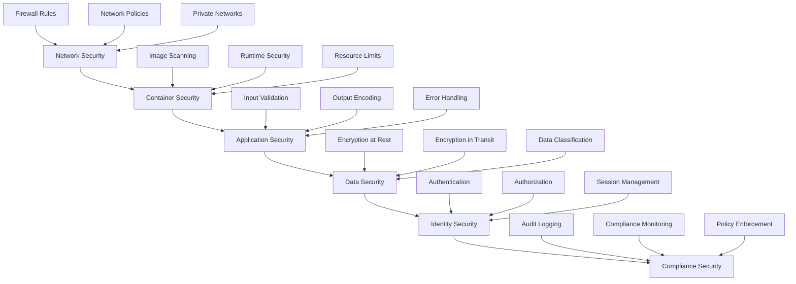

# Miso Container Security

## Overview

This guide covers comprehensive security considerations for the Miso container, including authentication, authorization, network security, data protection, and compliance requirements.

## Security Architecture

### Defense in Depth

The Miso container implements multiple layers of security:



## Authentication & Authorization

### Multi-Factor Authentication (MFA)

```bash
# Enable MFA for all users
ENABLE_MFA=true
MFA_REQUIRED=true
MFA_PROVIDER=azure-ad

# MFA Configuration
MFA_TIMEOUT=300
MFA_MAX_ATTEMPTS=3
MFA_LOCKOUT_DURATION=900
```

### Role-Based Access Control (RBAC)

```yaml
# RBAC Configuration
rbac:
  enabled: true
  policies:
    - name: "admin-policy"
      roles: ["admin"]
      permissions:
        - "miso:read"
        - "miso:write"
        - "miso:delete"
        - "miso:admin"
    
    - name: "developer-policy"
      roles: ["developer"]
      permissions:
        - "miso:read"
        - "miso:write"
    
    - name: "viewer-policy"
      roles: ["viewer"]
      permissions:
        - "miso:read"
```

### JWT Token Security

```bash
# JWT Configuration
JWT_SECRET=your-super-secret-jwt-key-min-32-chars
JWT_EXPIRY=24h
JWT_ISSUER=miso-controller
JWT_AUDIENCE=aifabrix-platform
JWT_ALGORITHM=HS256

# Token Security
JWT_REFRESH_ENABLED=true
JWT_REFRESH_EXPIRY=7d
JWT_BLACKLIST_ENABLED=true
JWT_BLACKLIST_TTL=24h
```

### OIDC Integration

```bash
# OIDC Configuration
OIDC_CLIENT_ID=your-oidc-client-id
OIDC_CLIENT_SECRET=your-oidc-client-secret
OIDC_ISSUER=https://your-tenant.b2clogin.com/your-tenant.onmicrosoft.com/v2.0/
OIDC_REDIRECT_URL=https://your-miso-instance.com/auth/callback
OIDC_SCOPES=openid,profile,email,offline_access

# OIDC Security
OIDC_STATE_VALIDATION=true
OIDC_NONCE_VALIDATION=true
OIDC_PKCE_ENABLED=true
OIDC_MAX_AGE=3600
```

## Network Security

### Firewall Configuration

```bash
# Inbound Rules
ALLOWED_INBOUND_PORTS=8080,9090
ALLOWED_INBOUND_IPS=10.0.0.0/8,172.16.0.0/12,192.168.0.0/16

# Outbound Rules
ALLOWED_OUTBOUND_PORTS=443,80
ALLOWED_OUTBOUND_DOMAINS=*.azure.com,*.microsoft.com,*.github.com

# Blocked IPs
BLOCKED_IPS=0.0.0.0/0
BLOCKED_COUNTRIES=CN,RU,IR,KP
```

### TLS/SSL Configuration

```bash
# TLS Configuration
TLS_VERSION_MIN=TLS1.2
TLS_VERSION_MAX=TLS1.3
TLS_CIPHER_SUITES=TLS_ECDHE_RSA_WITH_AES_256_GCM_SHA384,TLS_ECDHE_RSA_WITH_AES_128_GCM_SHA256
TLS_CERT_PATH=/app/certs/tls.crt
TLS_KEY_PATH=/app/certs/tls.key

# HSTS Configuration
HSTS_ENABLED=true
HSTS_MAX_AGE=31536000
HSTS_INCLUDE_SUBDOMAINS=true
HSTS_PRELOAD=true
```

### Rate Limiting

```bash
# Rate Limiting Configuration
RATE_LIMIT_ENABLED=true
RATE_LIMIT_REQUESTS_PER_MINUTE=1000
RATE_LIMIT_BURST_SIZE=100
RATE_LIMIT_WINDOW_SIZE=60s

# IP-based Rate Limiting
RATE_LIMIT_PER_IP=true
RATE_LIMIT_PER_IP_REQUESTS=100
RATE_LIMIT_PER_IP_WINDOW=60s

# User-based Rate Limiting
RATE_LIMIT_PER_USER=true
RATE_LIMIT_PER_USER_REQUESTS=500
RATE_LIMIT_PER_USER_WINDOW=60s
```

## Container Security

### Image Security

```bash
# Image Scanning
IMAGE_SCAN_ENABLED=true
IMAGE_SCAN_POLICY=high
IMAGE_SCAN_EXCLUDE_PATTERNS=test,dev

# Image Signing
IMAGE_SIGNING_ENABLED=true
IMAGE_SIGNING_KEY_PATH=/app/keys/signing.key
IMAGE_SIGNING_VERIFICATION=true
```

### Runtime Security

```bash
# Runtime Security Configuration
RUNTIME_SECURITY_ENABLED=true
RUNTIME_SECURITY_POLICY=strict
RUNTIME_SECURITY_MONITORING=true

# Process Monitoring
PROCESS_MONITORING_ENABLED=true
PROCESS_MONITORING_ALERT_THRESHOLD=10
PROCESS_MONITORING_LOG_LEVEL=info

# File System Monitoring
FILESYSTEM_MONITORING_ENABLED=true
FILESYSTEM_MONITORING_PATHS=/app,/tmp,/var/log
FILESYSTEM_MONITORING_EVENTS=create,modify,delete
```

### Resource Security

```bash
# Resource Limits
MEMORY_LIMIT=4Gi
CPU_LIMIT=1000m
DISK_LIMIT=20Gi

# Security Context
RUN_AS_USER=1000
RUN_AS_GROUP=1000
READ_ONLY_ROOT_FILESYSTEM=true
ALLOW_PRIVILEGE_ESCALATION=false
```

## Data Security

### Encryption at Rest

```bash
# Database Encryption
DATABASE_ENCRYPTION_ENABLED=true
DATABASE_ENCRYPTION_KEY_PATH=/app/keys/db-encryption.key
DATABASE_ENCRYPTION_ALGORITHM=AES-256-GCM

# File System Encryption
FILESYSTEM_ENCRYPTION_ENABLED=true
FILESYSTEM_ENCRYPTION_KEY_PATH=/app/keys/fs-encryption.key
FILESYSTEM_ENCRYPTION_ALGORITHM=AES-256-XTS
```

### Encryption in Transit

```bash
# TLS Configuration
TLS_ENABLED=true
TLS_CERT_PATH=/app/certs/tls.crt
TLS_KEY_PATH=/app/certs/tls.key
TLS_CA_PATH=/app/certs/ca.crt

# Database TLS
DATABASE_TLS_ENABLED=true
DATABASE_TLS_CERT_PATH=/app/certs/db-client.crt
DATABASE_TLS_KEY_PATH=/app/certs/db-client.key
DATABASE_TLS_CA_PATH=/app/certs/db-ca.crt
```

### Data Classification

```yaml
# Data Classification Policy
data_classification:
  public:
    description: "Publicly accessible data"
    encryption_required: false
    retention_period: "1y"
  
  internal:
    description: "Internal use only"
    encryption_required: true
    retention_period: "7y"
  
  confidential:
    description: "Confidential business data"
    encryption_required: true
    retention_period: "10y"
  
  restricted:
    description: "Highly sensitive data"
    encryption_required: true
    retention_period: "permanent"
    access_logging: true
```

## Secret Management

### Azure Key Vault Integration

```bash
# Key Vault Configuration
KEY_VAULT_URL=https://your-keyvault.vault.azure.net/
KEY_VAULT_CLIENT_ID=your-keyvault-client-id
KEY_VAULT_CLIENT_SECRET=your-keyvault-client-secret

# Secret Rotation
SECRET_ROTATION_ENABLED=true
SECRET_ROTATION_INTERVAL=90d
SECRET_ROTATION_NOTIFICATION_DAYS=30,7,1

# Secret Access Logging
SECRET_ACCESS_LOGGING=true
SECRET_ACCESS_LOG_LEVEL=info
SECRET_ACCESS_LOG_RETENTION=1y
```

### Environment Variable Security

```bash
# Environment Variable Security
ENV_VAR_ENCRYPTION_ENABLED=true
ENV_VAR_ENCRYPTION_KEY_PATH=/app/keys/env-encryption.key
ENV_VAR_MASKING_ENABLED=true
ENV_VAR_MASKING_PATTERNS=PASSWORD,SECRET,KEY,TOKEN
```

## Audit and Compliance

### Audit Logging

```bash
# Audit Logging Configuration
AUDIT_LOGGING_ENABLED=true
AUDIT_LOG_LEVEL=info
AUDIT_LOG_FORMAT=json
AUDIT_LOG_OUTPUT=stdout
AUDIT_LOG_RETENTION=7y

# Audit Events
AUDIT_EVENTS=login,logout,create,read,update,delete,admin
AUDIT_EVENT_DETAILS=true
AUDIT_EVENT_TIMESTAMP=true
AUDIT_EVENT_USER_ID=true
AUDIT_EVENT_IP_ADDRESS=true
```

### Compliance Monitoring

```bash
# Compliance Monitoring
COMPLIANCE_MONITORING_ENABLED=true
COMPLIANCE_STANDARDS=ISO27001,SOC2,GDPR
COMPLIANCE_REPORTING_ENABLED=true
COMPLIANCE_REPORTING_INTERVAL=monthly

# Policy Enforcement
POLICY_ENFORCEMENT_ENABLED=true
POLICY_VIOLATION_ALERTING=true
POLICY_VIOLATION_ACTION=alert,block,quarantine
```

### Data Privacy

```bash
# Data Privacy Configuration
DATA_PRIVACY_ENABLED=true
DATA_PRIVACY_REGULATIONS=GDPR,CCPA,PIPEDA
DATA_PRIVACY_RETENTION_POLICY=enabled
DATA_PRIVACY_RIGHT_TO_BE_FORGOTTEN=enabled
DATA_PRIVACY_DATA_PORTABILITY=enabled
```

## Security Monitoring

### Intrusion Detection

```bash
# Intrusion Detection
INTRUSION_DETECTION_ENABLED=true
INTRUSION_DETECTION_RULES=/app/config/ids-rules.yaml
INTRUSION_DETECTION_ALERTING=true
INTRUSION_DETECTION_RESPONSE=block,alert,log

# Anomaly Detection
ANOMALY_DETECTION_ENABLED=true
ANOMALY_DETECTION_THRESHOLD=3.0
ANOMALY_DETECTION_WINDOW=1h
ANOMALY_DETECTION_ALERTING=true
```

### Security Metrics

```bash
# Security Metrics
SECURITY_METRICS_ENABLED=true
SECURITY_METRICS_PORT=9090
SECURITY_METRICS_PATH=/metrics
SECURITY_METRICS_INTERVAL=15s

# Security Alerts
SECURITY_ALERTING_ENABLED=true
SECURITY_ALERT_CHANNELS=email,slack,webhook
SECURITY_ALERT_THRESHOLDS=critical,high,medium,low
```

## Vulnerability Management

### Vulnerability Scanning

```bash
# Vulnerability Scanning
VULNERABILITY_SCANNING_ENABLED=true
VULNERABILITY_SCANNING_INTERVAL=daily
VULNERABILITY_SCANNING_SEVERITY=high,critical
VULNERABILITY_SCANNING_ALERTING=true

# Dependency Scanning
DEPENDENCY_SCANNING_ENABLED=true
DEPENDENCY_SCANNING_INTERVAL=weekly
DEPENDENCY_SCANNING_ALERTING=true
```

### Patch Management

```bash
# Patch Management
PATCH_MANAGEMENT_ENABLED=true
PATCH_MANAGEMENT_INTERVAL=weekly
PATCH_MANAGEMENT_AUTO_UPDATE=false
PATCH_MANAGEMENT_APPROVAL_REQUIRED=true
PATCH_MANAGEMENT_TESTING_REQUIRED=true
```

## Security Best Practices

### 1. Principle of Least Privilege

- Grant minimum required permissions
- Regular permission reviews
- Implement role-based access control
- Use service accounts for automation

### 2. Defense in Depth

- Multiple security layers
- Fail-safe defaults
- Security by design
- Continuous monitoring

### 3. Secure by Default

- Secure default configurations
- Minimal attack surface
- Security-first design
- Regular security updates

### 4. Incident Response

- Documented incident response procedures
- Regular incident response drills
- Security team training
- Post-incident reviews

## Security Testing

### Security Testing Framework

```bash
# Security Testing
SECURITY_TESTING_ENABLED=true
SECURITY_TESTING_TYPES=static,dynamic,penetration
SECURITY_TESTING_INTERVAL=monthly
SECURITY_TESTING_REPORTING=true
```

### Penetration Testing

```bash
# Penetration Testing
PENETRATION_TESTING_ENABLED=true
PENETRATION_TESTING_INTERVAL=quarterly
PENETRATION_TESTING_SCOPE=full
PENETRATION_TESTING_REPORTING=true
```

## Security Incident Response

### Incident Response Plan

1. **Detection**: Automated monitoring and alerting
2. **Analysis**: Root cause analysis and impact assessment
3. **Containment**: Isolate affected systems
4. **Eradication**: Remove threats and vulnerabilities
5. **Recovery**: Restore normal operations
6. **Lessons Learned**: Post-incident review and improvements

### Emergency Procedures

```bash
# Emergency Shutdown
docker stop miso-controller

# Emergency Isolation
iptables -A INPUT -j DROP
iptables -A OUTPUT -j DROP

# Emergency Backup
docker exec miso-controller pg_dump $DATABASE_URL > emergency_backup.sql
```

## Compliance Requirements

### ISO 27001

- Information security management system
- Risk assessment and treatment
- Security controls implementation
- Continuous improvement

### SOC 2

- Security controls
- Availability controls
- Processing integrity
- Confidentiality controls
- Privacy controls

### GDPR

- Data protection by design
- Privacy impact assessments
- Data subject rights
- Breach notification

## Security Tools and Technologies

### Security Tools

- **Azure Security Center**: Cloud security monitoring
- **Azure Key Vault**: Secret management
- **Azure Active Directory**: Identity and access management
- **Azure Monitor**: Security monitoring and alerting
- **Azure Policy**: Compliance enforcement

### Security Technologies

- **TLS/SSL**: Transport layer security
- **JWT**: JSON Web Tokens for authentication
- **OIDC**: OpenID Connect for identity
- **RBAC**: Role-based access control
- **Encryption**: Data protection

## References

- [Azure Security Documentation](https://docs.microsoft.com/en-us/azure/security/)
- [Container Security Best Practices](https://kubernetes.io/docs/concepts/security/)
- [OWASP Security Guidelines](https://owasp.org/www-project-top-ten/)
- [ISO 27001 Standard](https://www.iso.org/isoiec-27001-information-security.html)
- [SOC 2 Framework](https://www.aicpa.org/interestareas/frc/assuranceadvisoryservices/aicpasoc2report.html)
- [GDPR Compliance Guide](https://gdpr.eu/)
