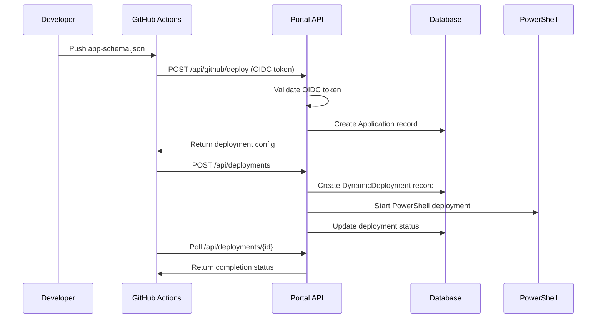
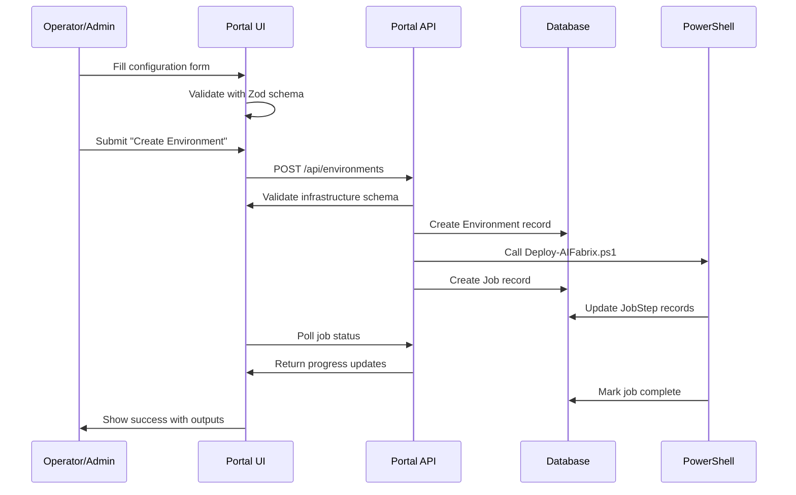
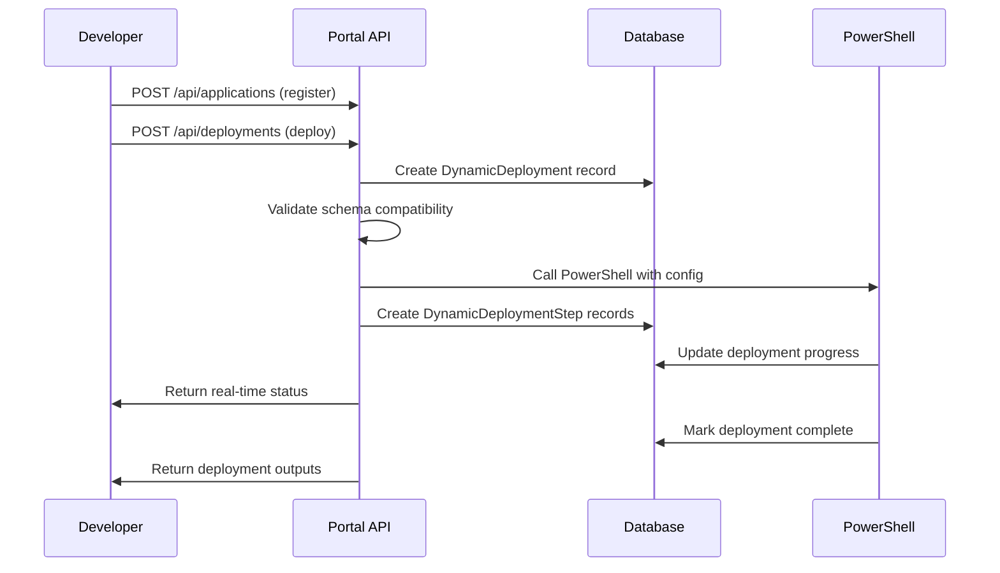
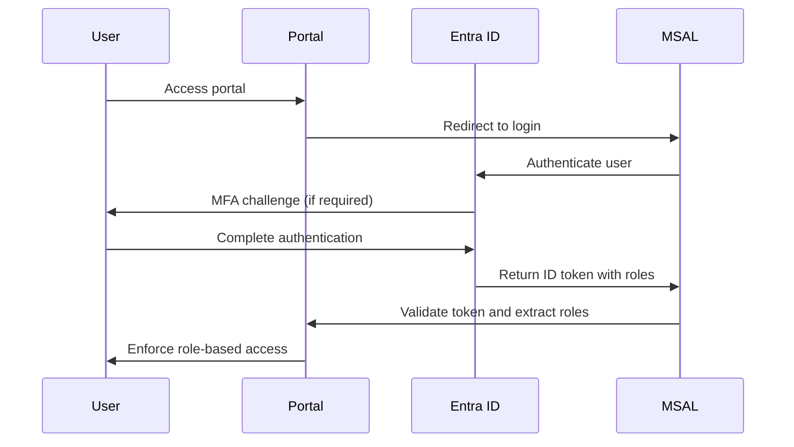

# Portal Architecture

## Overview

The AI Fabrix Setup Portal is a modern web application that provides a self-service interface for managing AI Fabrix deployments. Built with Next.js 15 and Microsoft Fluent UI, it offers an intuitive experience for operators and administrators to create environments, manage applications, and monitor deployments.

## System Architecture

### High-Level Architecture

```mermaid
graph TB
    subgraph "User Interface Layer"
        A[Dashboard] --> B[Environment Detail]
        B --> C[Job Detail]
    end
    
    subgraph "Authentication Layer"
        D[Admin Role] --> E[Operator Role]
        E --> F[Viewer Role]
    end
    
    subgraph "API Layer"
        G[/api/jobs] --> H[/api/envs]
        H --> I[/api/groups]
        I --> J[/api/auth]
        J --> K[/api/config]
        K --> L[/api/deploy]
    end
    
    subgraph "Database Layer"
        M[SQLite Local] --> N[PostgreSQL Production]
        N --> O[Prisma Models]
    end
    
    subgraph "Deployment Engine"
        P[Deploy-AIFabrix.ps1] --> Q[Config Validation]
        Q --> R[Status Reporting]
    end
    
    subgraph "Azure Resources"
        S[Key Vault] --> T[Storage Account]
        T --> U[Virtual Network]
        U --> V[PostgreSQL Server]
        V --> W[Redis Cache]
        W --> X[App Services]
    end
    
    A --> D
    D --> G
    G --> M
    M --> P
    P --> S
```

### Technology Stack

#### Frontend

- **Next.js 15**: React framework with App Router
- **React 19**: Latest React with concurrent features
- **Fluent UI**: Microsoft's design system for consistent UX
- **TypeScript**: Type-safe development
- **Tailwind CSS**: Utility-first CSS framework

#### Backend

- **Next.js API Routes**: Serverless API endpoints
- **Prisma ORM**: Database access and migrations
- **Zod**: Runtime type validation
- **MSAL**: Microsoft Authentication Library

#### Database

- **SQLite**: Local development database
- **PostgreSQL**: Production database with connection pooling
- **Prisma Client**: Type-safe database access

#### Azure Integration

- **Azure Identity**: Managed identity authentication
- **Azure Key Vault**: Secret management
- **Azure Storage**: Configuration and log storage
- **Azure Graph API**: Entra ID integration

## Data Flow Sequences

### Application Registration Flow



### Environment Creation Flow



### Dynamic Application Deployment Flow



## Security Architecture

### Authentication Flow



### Authorization Matrix

| Role     | Dashboard | Create Env | Update Env | View Jobs | Manage Roles | Deploy Apps |
|----------|-----------|------------|------------|-----------|--------------|-------------|
| Viewer   | ✅        | ❌         | ❌         | ✅        | ❌           | ❌         |
| Operator | ✅        | ✅         | ✅         | ✅        | ❌           | ✅         |
| Admin    | ✅        | ✅         | ✅         | ✅        | ✅           | ✅         |

### Secret Management

- **Portal**: No secrets stored, uses managed identity for Azure access
- **Database**: Encrypted sensitive data, no plaintext secrets
- **Configuration**: Stored in Key Vault, accessed via managed identity
- **GitHub OIDC**: Public identifiers only, no secrets in GitHub

## Database Schema

### Core Models

#### Application Model

```typescript
interface Application {
  id: string;
  key: string;
  displayName: string;
  type: string;
  image: string;
  registryMode: 'acr' | 'external' | 'public';
  requiresDatabase: boolean;
  requiresRedis: boolean;
  requiresStorage: boolean;
  environmentVariables: Record<string, any>;
  secrets: Record<string, any>;
  roles: string[];
  createdAt: Date;
  updatedAt: Date;
}
```

#### DynamicDeployment Model

```typescript
interface DynamicDeployment {
  id: string;
  applicationKey: string;
  environment: string;
  preset: string;
  location: string;
  serviceName: string;
  configuration: Record<string, any>;
  status: 'pending' | 'running' | 'completed' | 'failed';
  progress: number;
  message?: string;
  error?: string;
  dryRun: boolean;
  createdAt: Date;
  updatedAt: Date;
}
```

#### Environment Model

```typescript
interface Environment {
  id: string;
  serviceName: string;
  environment: 'dev' | 'tst' | 'pro';
  preset: string;
  location: string;
  status: 'pending' | 'running' | 'completed' | 'failed';
  createdAt: Date;
  updatedAt: Date;
}
```

## API Endpoints

### Application Management

- `GET /api/applications` - List all applications
- `POST /api/applications` - Register new application
- `GET /api/applications/[key]` - Get application details
- `PUT /api/applications/[key]` - Update application
- `DELETE /api/applications/[key]` - Remove application

### Deployment Management

- `POST /api/deployments` - Create new deployment
- `GET /api/deployments/[id]` - Get deployment status
- `DELETE /api/deployments/[id]` - Cancel deployment

### GitHub Integration

- `POST /api/github/deploy` - GitHub Actions deployment trigger
- `GET /api/github/oidc` - OIDC token validation

### Environment Management

- `GET /api/environments` - List environments
- `POST /api/environments` - Create environment
- `GET /api/environments/[id]` - Get environment details

## Deployment Architecture

### Portal Deployment

- **Platform**: Azure App Service or Container Apps
- **Networking**: Private endpoint with Front Door
- **SSL**: Managed certificate
- **Scaling**: Auto-scale based on CPU/memory
- **Database**: PostgreSQL Flexible Server with connection pooling

### PowerShell Integration

The existing `Deploy-AIFabrix.ps1` script is enhanced with:

#### Database Status Reporting

```powershell
function Write-DeploymentStatus {
    param($DeploymentId, $Status, $Progress, $Message, $Error)
    # Update DynamicDeployment record via API
}
```

#### Configuration Loading

```powershell
function Load-ConfigurationFromAPI {
    param($DeploymentId)
    # Fetch configuration from /api/deployments/{id}
}
```

#### Step Tracking

```powershell
function Write-DeploymentStep {
    param($DeploymentId, $StepId, $Name, $Status, $Progress)
    # Create DynamicDeploymentStep record
}
```

## Performance Considerations

### Database Optimization

- **Connection Pooling**: Prisma connection pool for PostgreSQL
- **Indexing**: Strategic indexes on frequently queried fields
- **Query Optimization**: Efficient Prisma queries with proper relations

### Caching Strategy

- **React Query**: Client-side caching for API responses
- **Static Generation**: Pre-built pages where possible
- **Edge Caching**: Azure Front Door for global distribution

### Scalability

- **Horizontal Scaling**: Multiple App Service instances
- **Database Scaling**: PostgreSQL read replicas
- **CDN**: Azure Front Door for static assets

## Security Considerations

### Data Protection

- **Encryption**: Database encryption at rest and in transit
- **Secrets**: Azure Key Vault for sensitive configuration
- **Access Control**: Role-based access control (RBAC)

### Network Security

- **Private Endpoints**: Database and storage private endpoints
- **WAF**: Azure Front Door Web Application Firewall
- **DDoS Protection**: Built-in Azure DDoS protection

### Compliance

- **ISO 27001**: Security management standards
- **Audit Logging**: Complete operation tracking
- **Data Residency**: Regional data storage compliance

## Benefits

### Security

- **Least Privilege Access**: Role-based permissions
- **Encrypted Data**: End-to-end encryption
- **Audit Trails**: Complete operation tracking
- **Managed Identity**: No secrets in application code

### Scalability

- **Modern React Patterns**: Efficient rendering and state management
- **Efficient Database Queries**: Optimized Prisma operations
- **Auto-scaling**: Azure App Service scaling

### Reliability

- **Type-safe Operations**: TypeScript throughout
- **Error Handling**: Comprehensive error management
- **Monitoring**: Built-in observability

### Maintainability

- **Clear Separation**: Well-defined layers and responsibilities
- **Modern Tooling**: Latest frameworks and libraries
- **Developer Experience**: GitHub-first development workflow

## Related Documentation

- [Miso Controller Architecture](miso-controller.md) - Core controller system
- [Security Authentication](security-authentication.md) - Authentication model
- [Getting Started Guide](../getting-started/quick-deploy.md) - Quick deployment
- [User Guides](../user-guides/portal-usage.md) - Portal usage instructions