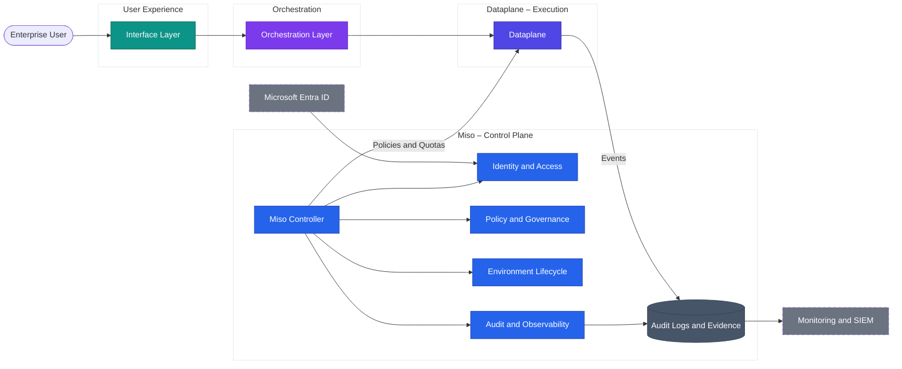

# Controller Layer (Miso)

**Governance, identity, policy, and lifecycle**

Miso is the **Controller layer** of AI Fabrix. It is the platform control plane responsible for:

- **Identity & access** (who can do what)
- **Policy & governance** (what is allowed and under which constraints)
- **Environment lifecycle** (how configurations are promoted and controlled)
- **Audit & observability** (how actions are recorded and evidenced)

## Control Plane vs Data Plane

AI Fabrix is intentionally split into:

- **Controller (Miso):** governs identity, policy, lifecycle, and evidence.
- **Dataplane:** executes integrations and processes business payloads (CIP and dataplane runtime).

This separation ensures governance is **structural**, not re-implemented in each app, agent, or integration.

## Why the Controller never touches business data

Miso is designed so it **does not handle business payloads**. Instead, it:

- Issues and validates identity context (Entra ID claims, groups, roles)
- Applies governance decisions (policies, quotas, allowed endpoints)
- Controls environments (dev/test/prod) and deployment promotion
- Records evidence (audit trails, access decisions, configuration change history)

Business data access and transformation occur only in the **Dataplane execution boundary**.

> Result: Governance can be audited and explained without requiring the Controller to become a data-processing system.

## What architects validate

- Control-plane components do not store or process business payloads.
- Identity context is preserved end-to-end (no "service account as user" pattern).
- Policies are evaluated consistently and centrally.
- Environment promotion is controlled and reproducible (Dev → Test → Prod).
- Auditing is deterministic (not forensic reconstruction).

---

## Controller Layer sub-articles

* **[Miso Overview](miso-overview/)** — Role of the Controller, control plane vs data plane separation, platform capabilities
* **[Identity & Access](identity-and-access/)** — Entra ID, RBAC and ABAC, SCIM, workspace and environment scoping
* **[Policy & Governance](policy-and-governance/)** — Policy packs, egress, model access, quotas, compliance
* **[Environment Lifecycle](environment-lifecycle/)** — Dev → Test → Prod promotion, drift prevention, versioning, approval gates
* **[Audit & Observability](audit-and-observability/)** — Audit trails, policy decisions, model usage tracking, cost attribution

---

## Miso in the architecture

---

**Key takeaway**: Miso governs who can do what, what is allowed, how environments are promoted, and how actions are evidenced — without touching business data. All data access happens in the Dataplane.
