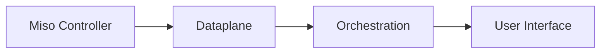

# Dataplane Overview

**Secure execution and enterprise data access**

The Dataplane is the execution boundary of AI Fabrix. It is the only layer allowed to access enterprise data, execute integrations, and process business payloads. All AI interactions, system integrations, and retrieval operations converge here under enforced identity, policy, and metadata controls.

The Dataplane exists to ensure that governance, security, and permission-awareness are structural — not implemented ad hoc in applications, workflows, or agents.

---

## What the Dataplane Is

The Dataplane is a product layer responsible for:

* Secure execution of integrations
* Metadata normalization
* Permission-aware retrieval
* Contract-based exposure of governed data

It runs entirely inside the customer's Azure tenant.

Miso (Controller) governs identity, policy, and lifecycle.
The Dataplane executes integrations and data access.
Orchestration layers consume governed outputs.

---

## Execution Boundary Explained

The Dataplane creates a hard separation between:

* **Control Plane (Miso)** — identity, RBAC/ABAC, policy packs, lifecycle
* **Dataplane** — integration execution, metadata, retrieval
* **Orchestration** — workflows and agents
* **UX Layer** — user interaction and collaboration

No other layer is permitted to:

* Call external systems directly
* Access enterprise data sources
* Execute integration logic
* Apply security filtering in application code

This separation guarantees identity preservation and deterministic policy enforcement.

---

## Why All Data Access Happens Here

Placing all execution in the Dataplane removes common enterprise AI failure modes:

* Identity loss during execution
* Service account sprawl
* Permission duplication in applications
* Audit reconstruction after the fact

Applications and agents express intent.
The Dataplane supplies governed, scoped data.

If data is not permitted for a user, it does not exist from the perspective of the request.

---

## Security and Isolation Model

The Dataplane inherits the customer's Azure security boundary:

* Azure networking and private endpoints
* Entra ID identity validation
* Azure Key Vault–backed secret management
* Explicit egress control policies

There is no shared SaaS control plane.
There are no cross-tenant execution paths.

All inbound requests carry validated identity context issued by Miso. The Dataplane trusts only Controller-issued tokens and enforces policy before data leaves the boundary.

---

## Dataplane Boundary Diagram

