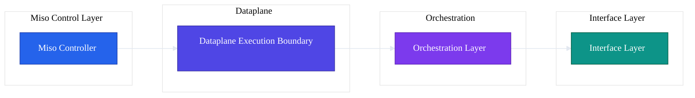
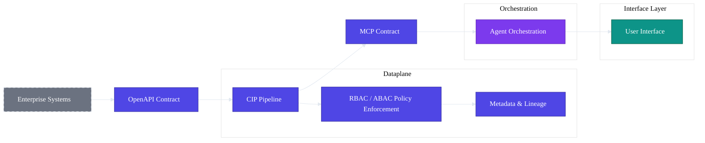

## 5. Dataplane

**Secure execution and enterprise data access**

The Dataplane is the execution boundary of AI Fabrix. It is the only layer allowed to access enterprise data, execute integrations, and process business payloads. All AI interactions, system integrations, and retrieval operations converge here under enforced identity, policy, and metadata controls.

The Dataplane exists to ensure that **governance, security, and permission-awareness are structural**, not implemented ad hoc in applications, workflows, or agents.

---

## 5.1 Dataplane Overview

### Execution Boundary Explained

The Dataplane is a hard architectural boundary between:

* **Governance and control** (Controller layer)
* **Business execution and data access** (Dataplane)
* **AI orchestration and UX** (Flowise, OpenWebUI, Copilot)

No other layer is permitted to:

* Call external systems
* Access enterprise data sources
* Execute integration logic
* Apply transformations or filtering on raw data

This separation ensures that:

* Identity is never dropped during execution
* Policy is always evaluated before data access
* AI never interacts with raw systems directly

### Why All Data Access Happens Here

Placing all data access in the Dataplane eliminates common enterprise AI failure modes:

* Service accounts bypassing user identity
* Duplicate permission logic in applications
* Inconsistent filtering across tools
* Non-deterministic audit trails

In AI Fabrix:

* Applications and agents **request intent**
* The Dataplane **supplies governed data**
* Enforcement happens **before data leaves the boundary**

If data is not permitted for the user, it does not exist from the perspective of the request.

### Security and Isolation Model

The Dataplane runs entirely inside the customer's Azure tenant and inherits:

* Azure networking and private endpoints
* Entra ID identity and token validation
* Azure Key Vault–backed secret management

Isolation guarantees:

* No shared SaaS control plane
* No cross-tenant data paths
* No execution outside approved network boundaries

All inbound requests carry validated identity context issued by the Controller. The Dataplane does not authenticate users itself; it **trusts only Controller-issued tokens**.

---

## 5.2 CIP — Composable Integration Pipelines

**The cornerstone of AI Fabrix**

CIP (Composable Integration Pipelines) is the AI-native integration fabric of the Dataplane. It replaces traditional integration patterns with a governed, declarative execution model.

### What CIP Is

CIP is a **declarative integration execution model** that:

* Executes inside the Dataplane boundary
* Enforces identity and policy at every step
* Normalizes metadata and lineage automatically
* Exposes governed data via OpenAPI and MCP contracts

### Why CIP Exists

Traditional integration approaches fail for AI because they:

* Drop user identity (service accounts)
* Require duplicate permission logic
* Produce opaque execution paths
* Make auditability forensic

CIP exists to make integration **identity-native, policy-aware, and inspectable by default**.

### CIP vs SDKs, Connectors, and iPaaS

| Approach | Problem | CIP Solution |
|----------|---------|--------------|
| SDKs | Identity lost, logic duplicated | Identity propagated automatically |
| Connectors | Opaque execution, limited audit | Fully inspectable pipelines |
| iPaaS | Black-box flows, service accounts | In-tenant, policy-enforced execution |

CIP is **not** an iPaaS and not workflow automation. It is an AI dataplane primitive.

### Declarative Pipeline Model

CIP pipelines are defined declaratively:

* Fetch
* Transform
* Normalize
* Filter
* Expose

There is no custom glue code in the default model. This enables:

* Static validation
* Deterministic execution
* Predictable cost
* Versioned promotion across environments

### Zero Service Accounts Architecture

CIP eliminates service accounts as the default integration model:

* User identity is validated by the Controller
* Delegated execution tokens are issued per request
* Backend credentials are scoped to systems, not users

There are no long-lived, over-privileged integration identities.

### Metadata, Lineage, and Inspectability

Every CIP execution produces:

* Normalized metadata fields
* Lineage to source system and pipeline version
* Execution logs and audit records

This enables deterministic answers to:

* Who accessed what
* Through which pipeline
* Under which policy
* At what time

---

### 5.2.1 CIP Execution Model

#### Declarative Pipelines (Default)

The default execution model uses declarative pipelines that:

* Are validated before deployment
* Are promoted via Dev → Test → Prod
* Generate OpenAPI and MCP contracts automatically

This model covers the majority of enterprise integration needs.

#### Governed Python Execution (Exceptional)

For cases where declarative pipelines are insufficient:

* Python execution is allowed as an exception
* Runs inside the same Dataplane boundary
* Subject to the same identity, policy, and audit controls

This does not create an escape hatch from governance.

#### Runtime Isolation and Policy Enforcement

At runtime, CIP enforces:

* RBAC and ABAC evaluation per request
* Policy packs (egress, quotas, compliance)
* Network and execution isolation

Policy is evaluated at **every step**, not only at entry.

---

### 5.2.2 Contracts and Interfaces

#### OpenAPI Contracts (System-to-System)

CIP exposes system integrations through OpenAPI contracts:

* Generated from pipeline definitions
* Versioned and environment-aware
* Suitable for application and system consumers

These contracts are portable and inspectable.

#### MCP Contracts (Agent-to-Dataplane)

For AI agents, CIP generates MCP (Model Context Protocol) contracts:

* Define tools available to agents
* Include schema, permissions, and metadata context
* Never expose raw systems

MCP provides **context and tools**, not storage or governance.

#### Versioning and Compatibility

All contracts are:

* Versioned explicitly
* Promoted via the Controller
* Backward-compatible by default

Breaking changes require explicit promotion and approval.

---

### 5.2.3 Security and Governance

#### Identity Propagation

* End-user identity is validated by the Controller
* Delegated tokens carry identity and group context
* CIP executions are always identity-scoped

There is no anonymous or system-level execution path.

#### RBAC and ABAC Enforcement

CIP enforces:

* RBAC from Entra ID groups and roles
* ABAC using normalized metadata dimensions

Filtering happens **before data is returned**, not in applications.

#### Policy Evaluation at Every Step

Policy packs govern:

* Allowed systems
* Data volumes and quotas
* Network egress
* Compliance constraints

Violations fail closed.

#### Full Auditability

Every execution is logged with:

* Identity
* Pipeline version
* Input parameters
* Output scope
* Policy decisions

Audit trails are deterministic, not reconstructed.

---

## 5.3 Core Dataplane Services

The Dataplane provides shared services used by CIP and retrieval.

### Enterprise Metadata Model

All data is normalized into a common metadata model:

* Business-aligned fields
* Typed attributes
* Lineage and provenance

Metadata is the foundation for permission-aware access.

### Permission-Aware Retrieval (RAG)

Retrieval engines enforce:

* Identity-scoped access
* Metadata filtering
* ABAC constraints

AI never receives data outside its permitted scope.

### Vector Search with Metadata Filtering

Vector similarity search is combined with:

* Mandatory metadata filters
* Identity-derived constraints

This prevents semantic leakage across permission boundaries.

### Delta Sync and Change Data Capture (CDC)

Dataplane supports:

* Full sync
* Incremental sync
* Change detection via content hashing

This enables efficient, predictable data refresh.

### Structured and Unstructured Ingestion

Supported ingestion patterns include:

* Structured records (CRM, ERP)
* Documents and files
* Hybrid datasets

All ingestion paths converge into the same metadata and governance model.

### Secure Runtime and Network Egress Control

Runtime execution is governed by:

* Azure networking controls
* Explicit egress policies
* Environment-specific restrictions

No outbound access is permitted unless explicitly allowed.

---

**Key takeaway**: The Dataplane is where enterprise data becomes AI-ready — securely, governably, and inspectably. CIP is the mechanism that makes this possible at scale.
