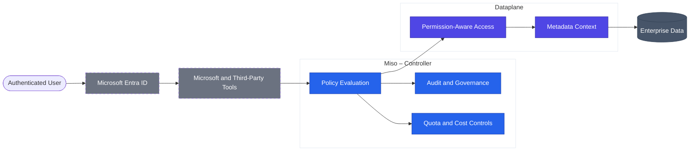

# Enterprise Capabilities

Enterprise capabilities in AI Fabrix are not optional features or configurable add-ons.  
They are **structural properties** of the platform that emerge from how identity, policy, dataplane execution, and governance are designed.

This section describes the core enterprise capabilities that allow AI Fabrix to be deployed, trusted, and operated in real enterprise and regulated environments.

---

## Identity-Native Security

### What This Means

AI Fabrix is **identity-native**, not identity-aware.

Identity is not injected into requests after the fact or inferred at the application layer.  
It is the **primary execution context** from authentication through data access, orchestration, and response.

Every action in the platform occurs **on behalf of an authenticated identity**.

### How Identity Works in AI Fabrix

Identity is established and preserved end-to-end using Microsoft Entra ID:

- Users authenticate via Entra ID (SSO, Conditional Access, MFA)
- Identity claims travel with every request
- RBAC and ABAC are evaluated centrally
- Execution occurs within the authority of the requesting identity

There are **no default system identities** acting on behalf of users.

### Why This Matters

Identity-native security ensures:

- Per-user data visibility is enforced automatically
- AI cannot access data outside the user's authority
- Audits can answer *who accessed what, when, and why*
- Security posture does not degrade as AI usage scales

Identity is not a feature.  
It is the **foundation of execution**.

---

## Metadata-First Architecture

### What This Means

AI Fabrix is built on a **metadata-first architecture**, not a document-first or vector-first model.

Data is not treated as opaque payloads.  
It is modeled as **business context** with structure, meaning, and ownership.

### Metadata as an Enforcement Layer

Every data element handled by the dataplane carries:

- Business dimensions
- Ownership and scope
- Source system identity
- Lineage and transformation history
- Permission context

This metadata is operational and enforced — not descriptive.

### Why This Matters

A metadata-first architecture enables:

- Permission-aware retrieval without custom filtering logic
- Explainable AI grounded in business context
- Deterministic audit trails
- Safe AI use in regulated environments

Metadata defines **what exists** for AI — not prompts or applications.

---

## Policy-Aware AI Access

### What This Means

AI Fabrix enforces policy **before data reaches AI**, not after results are generated.

AI is governed by the same policy model as humans and systems.

### Centralized Policy Enforcement

Policies are governed by the Controller (Miso) and enforced across:

- Data ingestion
- Retrieval and RAG
- APIs
- Agent execution
- User interaction

Policy types include:

- RBAC and ABAC
- Environment separation (Dev / Test / Prod)
- Egress controls
- Quotas and rate limits
- Compliance and data-handling rules

There are **no AI exception paths**.

### Why This Matters

Policy-aware AI access ensures:

- Governance scales automatically
- Compliance is deterministic
- Security reviews do not block production
- Risk does not grow with AI capability

---

## Predictable Cost Controls

### What This Means

AI Fabrix is designed for **predictable, infrastructure-based cost control**.

There are no per-prompt, per-agent, or per-integration platform fees.

### Cost Control by Design

Predictability comes from:

- In-tenant deployment (customer-controlled Azure billing)
- Explicit infrastructure sizing (S / M / L / XL)
- Governed execution through the dataplane
- Centralized quotas and limits

AI usage scales **linearly with infrastructure**, not experimentation.

### Why This Matters

Predictable costs enable:

- Confident budgeting and forecasting
- Enterprise-wide AI adoption
- Controlled experimentation
- Clear ROI evaluation

---

## Regulated Workload Readiness

### What This Means

AI Fabrix is designed to operate in **regulated and high-trust environments** without architectural modification.

Compliance is structural, not procedural.

### Structural Compliance Capabilities

AI Fabrix provides:

- End-to-end identity preservation
- Deterministic audit trails
- Full data lineage and provenance
- Environment isolation
- In-tenant execution
- Human-in-the-loop workflows

There is no special "regulated mode".

### Why This Matters

This enables AI usage in:

- Financial services
- Public sector
- Healthcare administration
- Legal and compliance environments

AI becomes usable where it was previously prohibited.

---

## Zero-Trust AI Architecture

### What This Means

AI Fabrix applies **zero-trust principles** to AI execution.

Nothing is trusted implicitly:
- Not users
- Not systems
- Not agents
- Not integrations

### Zero-Trust by Design

AI Fabrix enforces:

- Explicit identity verification
- Least-privilege access
- Contextual authorization
- Continuous policy evaluation
- No implicit trust between components

There are no shared service accounts and no persistent elevated privileges.

### Why This Matters

Zero-trust AI ensures:

- Breach impact is contained
- Lateral movement is prevented
- AI cannot amplify failures
- Trust boundaries remain intact at scale

---

## Enterprise Capability Flow (Identity → Policy → Dataplane)

The diagram below shows how enterprise capabilities are enforced structurally, independent of UI or agent tooling.

