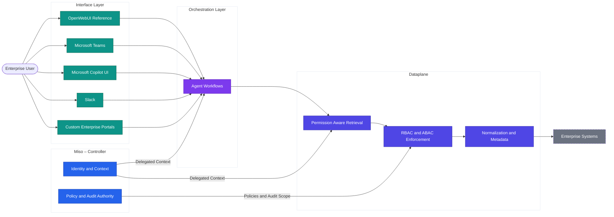

# Interface Concepts

The Interface Layer defines how humans interact with AI Fabrix–powered systems.
It is intentionally decoupled from orchestration logic and the Dataplane to ensure security, scalability, and interface flexibility.

The Interface Layer is **not** where integrations run, data is fetched, or policies are enforced.
Its responsibility is **interaction, context capture, and identity propagation**.

---

## Interface vs Orchestration vs Dataplane

AI Fabrix enforces a strict separation of responsibilities across three layers:

| Layer | Responsibility | What it does *not* do |
|------|---------------|----------------------|
| **Interface** | Human interaction, context input, response presentation | No integration logic, no data access |
| **Orchestration** | Agent logic, reasoning, tool selection | No policy enforcement, no raw system access |
| **Dataplane** | Data retrieval, normalization, RBAC/ABAC enforcement | No UI, no conversational state |

**Key rule**
Interfaces only call orchestration endpoints or MCP tools — never Dataplane APIs directly.

---

## Identity and Context Propagation

Every interface interaction carries **user identity and execution context** into the system.

1. User authenticates in the interface (e.g. Entra ID, Slack, Teams)
2. Identity is validated by Miso
3. A delegated execution token is issued
4. Orchestration and Dataplane receive user identity, groups, roles, and environment context

This enables:
- RBAC enforcement at operation level
- ABAC filtering at data level
- Full auditability of user actions
- Consistent access behavior across interfaces

---

## Human-in-the-Loop Patterns

Interfaces are the anchor point for human-in-the-loop workflows:

- Approval before write operations
- Review of AI-generated actions
- Validation of sensitive changes
- Case escalation to humans

Humans interact through interfaces.
Agents execute through orchestration.
Policies are enforced in the Dataplane.

---

## Architectural Context

The diagram below illustrates the supported execution flow and responsibility boundaries described in this article.

