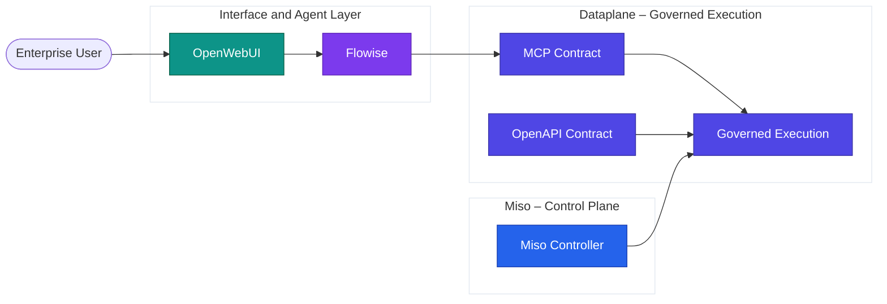

# Open Standards & Contracts

AI Fabrix is built on a deliberate architectural principle:

> **Open contracts define interaction. Controlled execution enforces governance.**

This separation ensures enterprise-grade inspectability, portability, and long-term architectural control.

---

## OpenAPI as the System Contract

OpenAPI is the **system-to-system contract** of AI Fabrix.

It defines how external systems, applications, and services interact with the AI Fabrix Dataplane without embedding governance, credentials, or business logic into client code.

### Role of OpenAPI

OpenAPI is used to:

* Expose governed dataplane capabilities
* Provide inspectable and versioned integration contracts
* Separate interface definition from execution and enforcement
* Enable portability across tools and platforms

OpenAPI describes *what* is available. The Dataplane decides *how* it is executed.

### What OpenAPI Is Not

OpenAPI does not contain:

* Permission logic
* Filtering rules
* Credentials or service accounts
* Governance decisions

All enforcement remains structural inside the Dataplane and Controller.

---

## MCP (Model Context Protocol)

MCP is the **agent-to-dataplane contract** in AI Fabrix.

It defines how AI agents request tools and context without direct system or data access.

### MCP in the Architecture

Through MCP:

* Agents request capabilities
* The platform evaluates identity and policy
* The Dataplane executes under governance

Agents never integrate directly with systems.

### MCP Responsibilities

MCP provides:

* Standardized tool definitions
* Explicit, inspectable agent interfaces
* Decoupling between agents and execution

MCP does not store data or enforce governance. Those responsibilities remain with Miso and the Dataplane.

---

## Why AI Fabrix Avoids Proprietary SDKs

AI Fabrix deliberately avoids proprietary SDK-centric integration models.

### Problems with SDK-Based Platforms

SDKs often:

* Embed security and governance assumptions
* Hide execution behavior
* Introduce vendor lock-in
* Complicate audits and exit scenarios

### AI Fabrix Approach

AI Fabrix uses:

* OpenAPI for system integration
* MCP for agent interaction
* Declarative Dataplane pipelines for execution

This keeps execution governed, inspectable, and independent of client implementation choices.

---

## Inspectability and Exit Strategy

Inspectability is a first-class architectural requirement.

Every layer exposes:

* Declarative definitions
* Explicit contracts
* Deterministic audit paths

### Exit by Design

Because AI Fabrix relies on:

* Open standards
* In-tenant execution
* Declarative integration logic

Customers retain a clear exit path without losing data, architecture, or governance models.

---

## Architecture Overview Diagram

---

## Section Summary

| Area               | Approach                |
| ------------------ | ----------------------- |
| System integration | OpenAPI contracts       |
| Agent interaction  | MCP                     |
| Execution          | Governed Dataplane      |
| Governance         | Miso Controller         |
| SDK lock-in        | Explicitly avoided      |
| Auditability       | Deterministic by design |
| Exit strategy      | Built-in                |
