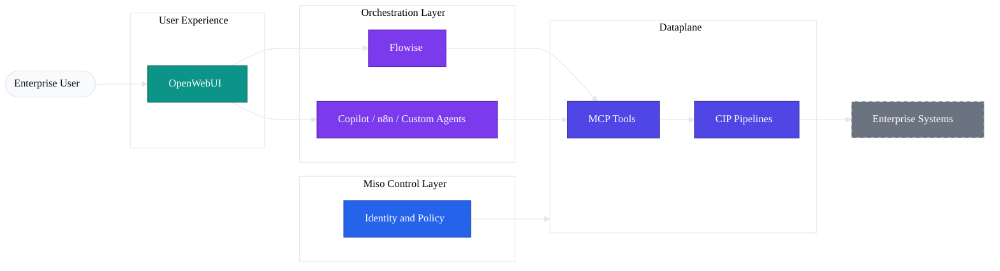

# Orchestration Layer

The Orchestration Layer is responsible for **building AI workflows and agents** that consume governed capabilities exposed by the AI Fabrix Dataplane.

Orchestration does **not** integrate directly with enterprise systems and does **not** implement access control logic. Its sole responsibility is to coordinate reasoning, workflow steps, and tool invocation using **pre-governed interfaces**.

In AI Fabrix, orchestration is intentionally decoupled from data access to preserve security, auditability, and architectural clarity.

---

## Orchestration in the Overall Architecture

---

## Orchestration Concepts

### What Orchestration Means in AI Fabrix

Orchestration is the layer where:

- AI agents and workflows are defined
- Reasoning, branching, and control flow occur
- Governed tools are invoked to retrieve or act on data

It is **not** the layer where:

- External systems are connected
- Credentials are managed
- Permissions are enforced
- Business data is filtered

Those responsibilities belong exclusively to the **Dataplane**.

Orchestration answers:

> "Given a user intent and available governed tools, how should the AI proceed?"

Not:

> "How do I access this system or secure this data?"

---

### Separation from Data Access

AI Fabrix enforces a strict separation between orchestration and data access:

- Orchestration layers **never** call raw APIs
- Orchestration layers **never** hold credentials
- Orchestration layers **never** implement filtering or permission logic

All data access is executed by governed pipelines in the Dataplane.

This ensures:

- Identity is preserved end-to-end
- Permissions cannot be bypassed
- Audits are deterministic
- Orchestration engines remain replaceable

---

### Identity-Aware Tool Consumption

Orchestration layers consume tools **on behalf of an authenticated user**.

Execution flow:

1. User authenticates via Entra ID  
2. Identity and group context is evaluated by the Controller (Miso)  
3. Orchestration invokes a tool using MCP  
4. The Dataplane enforces RBAC, ABAC, and policy  
5. Only permitted data or actions are executed  

Implications:

- Orchestration does not encode authorization logic
- Tools behave identically across orchestration engines
- AI agents cannot escalate privileges

AI agents are **first-class governed actors**.

---

## Orchestration Options

AI Fabrix is orchestration-agnostic by design.

Any orchestration engine may be used **as long as it consumes governed tools exposed by the Dataplane**.

> Orchestration layers consume CIP pipelines as governed tools.  
> They never connect directly to raw enterprise systems.

---

### Flowise (Reference Implementation)

Flowise is the **reference orchestration implementation**.

Characteristics:

- Visual, inspectable agent and workflow definitions
- Native support for tool-based agent execution
- Clear separation of prompts, tools, and control flow

In AI Fabrix:

- Flowise consumes MCP tools generated from CIP pipelines
- It has no direct system access
- It follows the Controller lifecycle for promotion

Flowise is a reference, not a dependency.

---

### Microsoft Copilot / Copilot Studio

Microsoft Copilot can act as an orchestration layer when:

- It does not connect directly to enterprise systems
- All data access is mediated by the Dataplane
- Identity and authorization are enforced centrally

Copilot is a **consumer**, not a competing platform.

---

### n8n

n8n may be used for workflow-style orchestration when:

- It consumes MCP or OpenAPI interfaces
- It does not manage credentials
- It does not implement access logic

Typical use cases include event-driven or scheduled AI-assisted workflows.

---

### Custom Agent Frameworks

Custom agent frameworks are supported **by contract, not by SDK**.

Requirements:

- Consume MCP or OpenAPI interfaces
- Do not embed credentials
- Do not bypass Dataplane enforcement

This ensures portability, inspectability, and consistent governance.

---

## Agent and Workflow Design

### Tool Invocation via MCP

AI agents invoke tools using **Model Context Protocol (MCP)**.

MCP provides:

- Typed, inspectable tool definitions
- Explicit agent-to-dataplane contracts
- Capability-based exposure

Clarifications:

- MCP does **not** store data
- MCP does **not** enforce permissions
- All enforcement remains in the Dataplane

---

### Prompt and Workflow Versioning

Orchestration artifacts are deployable assets:

- Prompts are versioned
- Agent definitions are versioned
- Workflows are versioned

This enables reproducibility, auditability, and rollback.

---

### Environment Promotion

Orchestration follows the same lifecycle model as the platform:

- Development → Test → Production
- Promotion is policy-gated
- Changes are auditable

> If behavior differs between environments, it is a defect.

---

### Failure Handling and Observability

Orchestration failures are **first-class operational events**.

Principles:

- Failures are explicit
- Partial execution is observable
- Tool failures are distinguishable from model failures

Observability captures:

- Which agent invoked which tool
- Under which identity
- Using which pipeline
- With which outcome

---

## Summary

The Orchestration Layer in AI Fabrix:

- Coordinates reasoning and workflows
- Consumes governed tools only
- Never accesses raw systems
- Never enforces permissions

By separating **thinking** from **data access**, AI Fabrix enables safe evolution of agents and workflows without reintroducing security, compliance, or audit risk.
