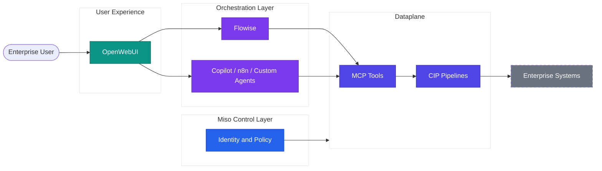

# Orchestration Layer

The Orchestration Layer is responsible for **building AI workflows and agents** that consume governed capabilities exposed by the AI Fabrix Dataplane.

Orchestration does **not** integrate directly with enterprise systems and does **not** implement access control logic. Its sole responsibility is to coordinate reasoning, workflow steps, and tool invocation using **pre-governed interfaces**.

In AI Fabrix, orchestration is intentionally decoupled from data access to preserve security, auditability, and architectural clarity.

---

## Orchestration in the Overall Architecture

```mermaid
flowchart LR

%% ==================================================
%% Class Definitions (Mandatory) [cite: 68-75]
%% ==================================================
classDef control fill:#2563EB,color:#ffffff,stroke:#1E40AF
classDef core fill:#4F46E5,color:#ffffff,stroke:#3730A3
classDef flow fill:#7C3AED,color:#ffffff,stroke:#5B21B6
classDef ui fill:#0D9488,color:#ffffff,stroke:#065F46
classDef external fill:#6B7280,color:#ffffff,stroke-dasharray: 5 5

%% Neutralize subgraph backgrounds for architectural neutrality [cite: 144]
style ux_layer fill:none,stroke:#E2E8F0
style orchestration_layer fill:none,stroke:#E2E8F0
style dataplane_layer fill:none,stroke:#E2E8F0
style miso_control_layer fill:none,stroke:#E2E8F0

%% ==================================================
%% Nodes & Subgraphs [cite: 51, 83-93]
%% ==================================================
enterprise_user([Enterprise User])

subgraph ux_layer["User Experience"]
    open_webui["OpenWebUI"]:::ui
end

subgraph orchestration_layer["Orchestration Layer"]
    flowise_engine["Flowise"]:::flow
    third_party_agents["Copilot / n8n / Custom Agents"]:::flow
end

subgraph dataplane_layer["Dataplane"]
    mcp_tools["MCP Tools"]:::core
    cip_tools["CIP Pipelines"]:::core
end

subgraph miso_control_layer["Miso Control Layer"]
    identity_policy["Identity and Policy"]:::control
end

enterprise_systems["Enterprise Systems"]:::external

%% ==================================================
%% Relationships & Flow [cite: 101-107]
%% ==================================================
enterprise_user --> open_webui
open_webui --> flowise_engine
open_webui --> third_party_agents

flowise_engine --> mcp_tools
third_party_agents --> mcp_tools
mcp_tools --> cip_tools

identity_policy --> dataplane_layer
cip_tools --> enterprise_systems
```

---

## Orchestration sub-articles

* **[Orchestration Concepts](orchestration-concepts/)** — What orchestration means in AI Fabrix, separation from data access, identity-aware tool consumption
* **[Orchestration Options](orchestration-options/)** — Flowise, Microsoft Copilot, n8n, and custom agent frameworks
* **[Agent and Workflow Design](agent-and-workflow-design/)** — MCP tool invocation, versioning, environment promotion, failure handling and observability

---

**Key takeaway**: By separating **thinking** from **data access**, AI Fabrix enables safe evolution of agents and workflows without reintroducing security, compliance, or audit risk.
