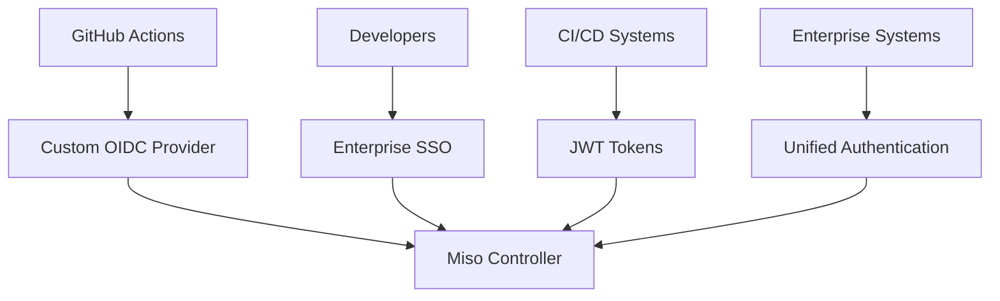

# Miso Controller Architecture

## Overview

Miso is the enterprise AI controller that serves as the central orchestration platform for AI Fabrix. It provides secure, automated deployment and management of AI applications within your Azure tenant, eliminating traditional barriers between AI experimentation and production deployment.

## Key Benefits

- **Centralized Control**: Single point of authentication and deployment orchestration
- **Enterprise Security**: Built-in ISO 27001 compliance and audit trails
- **Automated Deployment**: Seamless development → testing → production pipeline
- **Zero Credential Exposure**: Custom OIDC authentication eliminates security risks
- **Open Source Foundation**: No vendor lock-in with transparent, portable components

## Architecture Components

### Authentication Gateway

Miso acts as a centralized authentication gateway using a custom OIDC-like system:

**Security Model:**

- **Public Identifiers Only**: GitHub stores only Application GUID, Subscription GUID, Environment GUID
- **Short-Lived Tokens**: Custom OIDC provider issues time-limited deployment tokens
- **Multi-Subscription Architecture**: Miso operates in separate subscription from customer deployments
- **Zero Secret Storage**: No passwords or credentials stored in external systems

### Three-Environment Pipeline

Miso implements a seamless progression through development, testing, and production environments:

#### Development Environment

- **Purpose**: Rapid iteration and experimentation
- **Access**: Permissive developer access for testing
- **Images**: Public images for quick setup
- **Features**: Full debugging and monitoring capabilities

#### Testing Environment

- **Purpose**: Production parity validation
- **Access**: Controlled developer access for validation
- **Images**: Enterprise ACR images for testing
- **Features**: Full end-to-end testing capabilities

#### Production Environment

- **Purpose**: Enterprise-grade production deployment
- **Access**: Restricted read-only access for most operations
- **Images**: Enterprise ACR images with security scanning
- **Features**: High availability, enterprise integration, full monitoring

### Two-Phase Deployment Strategy

#### Phase 1: Baseline Infrastructure

- **Secure Foundation**: Network, Key Vault, Storage, Database, ACR
- **Enterprise Security**: Private endpoints, RBAC, audit logging
- **Compliance Ready**: ISO 27001 aligned infrastructure
- **Zero Application Risk**: No applications deployed until ready

#### Phase 2: Application Selection Portal

- **Self-Service Portal**: Developers select applications through enterprise-controlled interface
- **Application Registry**: Curated catalog of available applications
- **Enterprise Access Control**: Token service integration for enterprise features
- **Deployment Orchestration**: Automated, audited application deployment

## Security Architecture

### In-Tenant by Default

- **Data Sovereignty**: All AI operations occur within your Azure subscription
- **Private Endpoints**: All services accessible only within your network
- **Network Isolation**: Complete separation from external AI services
- **Audit Compliance**: Full audit trail of all operations

### ISO 27001 Aligned Controls

- **Identity Management**: Entra ID SSO with RBAC inheritance
- **Secret Management**: Azure Key Vault with rotation policies
- **Access Control**: Role-based access with enterprise group integration
- **Audit Logging**: Structured logs with compliance reporting
- **Change Control**: Automated deployment with approval workflows

### Enterprise Token Service Integration

- **Customer Authentication**: Enterprise SSO integration
- **Subscription Validation**: Real-time enterprise feature validation
- **ACR Access Control**: Secure container registry access
- **Usage Tracking**: Enterprise billing and compliance reporting

## Deployment Architecture

### Infrastructure Components

- **Azure Virtual Network**: Private networking with isolation
- **Azure Key Vault**: Centralized secret management
- **Azure Storage**: Secure data storage and configuration
- **PostgreSQL**: Metadata and application state management
- **Redis Cache**: Performance optimization and session management
- **Azure Container Registry**: Secure image storage and distribution
- **Azure Front Door**: Security gateway and global distribution

### Application Ecosystem

- **Flowise**: Visual workflow builder for AI automation
- **OpenWebUI**: Enterprise chat and workbench interface
- **AI Fabrix Core**: Enterprise features and governance
- **Miso Backend**: Licensing, entitlements, and ACR credentials

## Operational Excellence

### Automated Promotion Pipeline

1. **Development Validation**: Automated testing and validation
2. **Testing Deployment**: Automated promotion to testing environment
3. **Production Readiness**: Automated production deployment with approvals
4. **Rollback Capability**: Automated rollback if issues detected

### Comprehensive Monitoring

- **Structured Logging**: All operations logged with enterprise context
- **Metrics & Traces**: Performance and reliability monitoring
- **Evaluation Hooks**: AI model performance and drift detection
- **Alerting**: Proactive issue detection and resolution

### Exit Path Preservation

- **Open Source Foundation**: Core components remain open source
- **No Vendor Lock-in**: Customer retains full control of data and workflows
- **Portability**: Applications can run independently if needed
- **Transparency**: Full visibility into AI operations and data processing

## Business Impact

### Accelerated AI Adoption

- **Traditional Timeline**: 12+ months to production AI
- **Miso Timeline**: 4 weeks to production AI with full pipeline
- **Time Savings**: 75% reduction in infrastructure setup time
- **Operational Efficiency**: 90% reduction in credential management overhead

### Enhanced Security Posture

- **Zero Credential Exposure**: No Azure credentials in external systems
- **Centralized Control**: Single point of security policy enforcement
- **Enterprise Integration**: Seamless SSO and RBAC
- **Audit Compliance**: Complete visibility into all operations

## Enterprise Integration

### Existing System Connectivity

- **SharePoint**: Document processing and knowledge management
- **Teams**: Collaborative AI workflows and notifications
- **CRM/ERP**: Business process automation and insights
- **HR Systems**: Employee data processing and analytics
- **Finance Systems**: Financial data analysis and reporting

### Enterprise Connectors

- **Server-side Execution**: All processing within customer environment
- **Audit Trails**: Complete visibility into data access and processing
- **Versioned Schemas**: Backward compatibility and migration support
- **Governance Controls**: Usage limits and approval workflows

## Implementation Timeline

### Week 1: Development Environment

- Deploy secure development foundation
- Deploy Flowise and OpenWebUI applications
- Configure permissive access for experimentation
- Enable debugging and monitoring tools

### Week 2: Testing Environment

- Deploy production-parity testing environment
- Switch to ACR images for enterprise testing
- Implement controlled developer access
- Validate end-to-end functionality

### Week 3: Production Environment

- Deploy full security controls
- Implement read-only access policies
- Configure multi-zone deployment
- Enable all enterprise features

### Week 4: Automated Pipeline

- Implement dev → test → prod promotion pipeline
- Configure automated approvals
- Enable automated rollback capabilities
- Deploy comprehensive observability

## Success Metrics

### Technical KPIs

- **Deployment Time**: < 4 weeks to production
- **Security Incidents**: Zero credential exposure
- **Compliance Score**: 100% ISO 27001 alignment
- **Uptime**: 99.9% availability SLA

### Business KPIs

- **Time to Value**: < 30 days to first AI solution
- **Cost Reduction**: 60% reduction in operational overhead
- **Developer Productivity**: 3x faster AI development
- **Enterprise Adoption**: 90% of business units using AI

## Related Documentation

- [Portal Architecture](portal-architecture.md) - Detailed portal system design
- [Security Authentication](security-authentication.md) - Authentication and security model
- [Getting Started Guide](../getting-started/quick-deploy.md) - Quick deployment guide
- [User Guides](../user-guides/portal-usage.md) - Portal usage instructions
