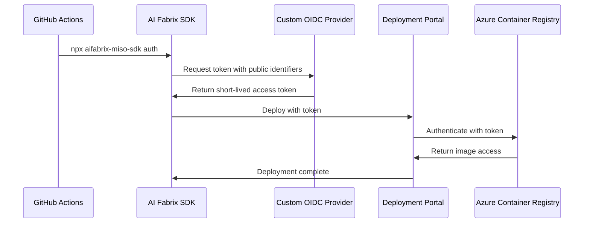
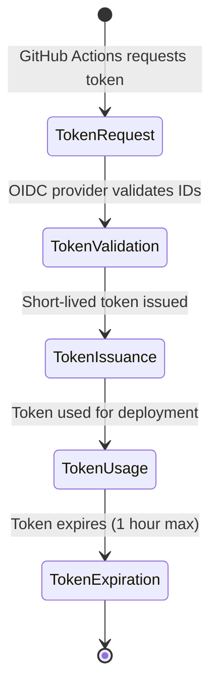

# Security Authentication

## Overview

AI Fabrix implements a secure authentication system that provides Azure OIDC-level security with complete enterprise control over the authentication and deployment process. The system ensures that GitHub stores only public identifiers (GUIDs), never secrets or passwords, while providing seamless developer experience through the AI Fabrix TypeScript SDK.

## Key Security Principles

- **Zero Secret Storage**: No passwords or credentials stored in GitHub or external systems
- **Public Identifiers Only**: GitHub stores only Application GUID, Subscription GUID, Environment GUID
- **Short-Lived Tokens**: Custom OIDC provider issues time-limited deployment tokens
- **Multi-Subscription Architecture**: Miso operates in separate subscription from customer deployments
- **Perfect Isolation**: Complete separation between Miso and customer environments

## Authentication Model

### Security Context

Each application has its own security context with three key identifiers:

- **Client ID**: Application GUID (e.g., `mori-12345678-1234-1234-1234-123456789012`)
- **Tenant ID**: Subscription GUID (e.g., `customer-87654321-4321-4321-4321-210987654321`)
- **Environment ID**: Environment GUID (e.g., `dev-aifabrix-11111111-2222-3333-4444-555555555555`)

### Multi-Subscription Architecture

#### Miso Subscription

- **Tenant ID**: `miso-87654321-4321-4321-4321-210987654321`
- **Applications**: Miso controller, marketplace services
- **Control**: eSystems manages Miso subscription

#### Customer Subscriptions

- **Tenant ID**: `customer-11111111-2222-3333-4444-555555555555`
- **Applications**: Mori, Flowise, OpenWebUI, customer applications
- **Control**: Customer manages their subscription

## Registry Mode Authentication

### Authentication Requirements

| Registry Mode | Image Source | Authentication Required | Reason |
|---------------|--------------|------------------------|---------|
| `acr` | Customer's Azure Container Registry | ✅ Yes | Private registry access |
| `external` | AI Fabrix images in customer tenant | ✅ Yes | Private AI Fabrix images |
| `public` | Public Docker Hub, GitHub Container Registry | ❌ No | Public access |

### Authentication Flow



## SDK Integration

### Command Structure

The AI Fabrix TypeScript SDK provides three main commands:

1. **`auth`**: Authenticate with AI Fabrix using public identifiers
2. **`validate`**: Validate application schema before deployment
3. **`deploy`**: Deploy application with validated configuration

### GitHub Actions Workflow

```yaml
name: Deploy Application
on:
  push:
    branches: [main]

jobs:
  deploy:
    runs-on: ubuntu-latest
    steps:
      - name: Checkout code
        uses: actions/checkout@v3
      
      - name: Setup Node.js
        uses: actions/setup-node@v3
        with:
          node-version: '18'
      
      - name: Install AI Fabrix SDK
        run: npm install aifabrix-miso-sdk
      
      - name: Authenticate with AI Fabrix
        run: |
          npx aifabrix-miso-sdk auth \
            --client-id ${{ secrets.APP_CLIENT_ID }} \
            --tenant-id ${{ secrets.APP_TENANT_ID }} \
            --environment-id ${{ secrets.APP_ENVIRONMENT_ID }}
      
      - name: Validate Application Schema
        run: |
          npx aifabrix-miso-sdk validate \
            --schema app-schema.json
      
      - name: Deploy Application
        run: |
          npx aifabrix-miso-sdk deploy \
            --schema app-schema.json \
            --config app-deployment.json
```

## Security Implementation

### GitHub Repository Secrets

**Only Public Identifiers (No Secrets!):**

```yaml
# Application repository secrets
APP_CLIENT_ID: "app-12345678-1234-1234-1234-123456789012"
APP_TENANT_ID: "customer-11111111-2222-3333-4444-555555555555"
APP_ENVIRONMENT_ID: "dev-aifabrix-22222222-3333-4444-5555-666666666666"
```

### OIDC Token Request

**GitHub Actions calls OIDC provider:**

```bash
POST https://your-oidc-provider.com/oauth2/token
Content-Type: application/json

{
  "client_id": "app-12345678-1234-1234-1234-123456789012",
  "tenant_id": "customer-11111111-2222-3333-4444-555555555555",
  "environment_id": "dev-aifabrix-22222222-3333-4444-5555-666666666666",
  "grant_type": "client_credentials"
}
```

**Response:**

```json
{
  "access_token": "eyJ0eXAiOiJKV1QiLCJhbGciOiJSUzI1NiIs...",
  "token_type": "Bearer",
  "expires_in": 3600
}
```

### Secure Deployment API

**GitHub Actions calls deployment API:**

```bash
POST https://your-deployment-api.com/api/applications/app-key/deploy
Authorization: Bearer {access_token_from_oidc}
Content-Type: application/json

{
  "environment": "dev-aifabrix",
  "image": "aifabrix/app:v1.2.3",
  "registryMode": "external",
  "environmentVariables": [...],
  "secrets": [...]
}
```

## Application Examples

### External Registry Deployment

**Application uses AI Fabrix images in customer tenant:**

```yaml
name: Deploy Application
on:
  push:
    branches: [main]

jobs:
  deploy:
    runs-on: ubuntu-latest
    steps:
      - name: Authenticate with AI Fabrix
        run: |
          npx aifabrix-miso-sdk auth \
            --client-id ${{ secrets.APP_CLIENT_ID }} \
            --tenant-id ${{ secrets.APP_TENANT_ID }} \
            --environment-id ${{ secrets.APP_ENVIRONMENT_ID }}
      
      - name: Deploy Application
        run: |
          npx aifabrix-miso-sdk deploy \
            --schema app-schema.json \
            --config app-deployment.json
```

### ACR Registry Deployment

**Application uses customer's own Azure Container Registry:**

```yaml
name: Deploy Application
on:
  push:
    branches: [main]

jobs:
  deploy:
    runs-on: ubuntu-latest
    steps:
      - name: Authenticate with AI Fabrix
        run: |
          npx aifabrix-miso-sdk auth \
            --client-id ${{ secrets.APP_CLIENT_ID }} \
            --tenant-id ${{ secrets.APP_TENANT_ID }} \
            --environment-id ${{ secrets.APP_ENVIRONMENT_ID }}
      
      - name: Deploy Application
        run: |
          npx aifabrix-miso-sdk deploy \
            --schema app-schema.json \
            --config app-deployment.json
```

**Note**: ACR registry mode requires Azure Container Registry infrastructure to be deployed first.

### Public Registry Deployment

**Application uses public images (no authentication needed):**

```yaml
name: Deploy Application
on:
  push:
    branches: [main]

jobs:
  deploy:
    runs-on: ubuntu-latest
    steps:
      - name: Deploy Application
        run: |
          npx aifabrix-miso-sdk deploy \
            --schema app-schema.json \
            --config app-deployment.json
```

## Security Benefits

### Perfect Isolation

- ✅ **Application Isolation**: Each app has its own security context
- ✅ **Subscription Isolation**: Miso and customer apps in separate subscriptions
- ✅ **Environment Isolation**: Dev/test/prod separation
- ✅ **Registry Isolation**: Different authentication per registry type

### Enterprise Control

- ✅ **No Secrets in GitHub**: Only public GUIDs stored
- ✅ **Short-lived Tokens**: 1 hour max expiration
- ✅ **Custom OIDC Provider**: Complete control over authentication
- ✅ **Audit Compliance**: Full control over logging and monitoring

### Operational Benefits

- ✅ **Flexible Deployment**: Different strategies per application
- ✅ **Independent Scaling**: Each app scales independently
- ✅ **Repository Autonomy**: Each repo manages its own deployment
- ✅ **Easy Onboarding**: New apps get their own security context

## Token Management

### Token Lifecycle



### Token Security

- **Short-lived**: Maximum 1 hour expiration
- **Application-scoped**: Tokens only work for specific application
- **Environment-scoped**: Tokens only work in specific environment
- **Audit trail**: All token usage logged

## Integration with Existing Schemas

This authentication system works seamlessly with existing configuration schemas:

- **Application Schema**: `registryMode` determines authentication requirement
- **Environment Schema**: Environment-specific deployment with secure tokens
- **Infrastructure Schema**: Subscription and tenant management

**No changes needed to existing schemas** - this authentication system operates at the deployment layer, providing secure access to private registries while maintaining the existing configuration structure.

### Database Reference Integration

The authentication system works seamlessly with the database reference approach:

- **Environment Variables**: Use `databases[0].urlKeyVaultName` to reference database URLs
- **Secrets**: Use `databases[0].passwordKeyVaultName` to reference database passwords
- **No Duplication**: Database secrets are referenced directly without duplication in Key Vault
- **Automatic Prefixing**: Backend automatically prefixes database secrets with application key

## Best Practices

### Security

- **Least Privilege**: Applications only access their own resources
- **Token Rotation**: Automatic token expiration and renewal
- **Audit Logging**: All authentication and deployment activities logged
- **Environment Separation**: No cross-environment access

### Operations

- **Repository Secrets**: Only store public identifiers
- **Token Management**: Let the system handle token lifecycle
- **Error Handling**: Graceful handling of authentication failures
- **Monitoring**: Monitor authentication success/failure rates

### Compliance

- **ISO 27001**: Meets enterprise security standards
- **Audit Trail**: Complete deployment and access logging
- **Data Protection**: No sensitive data stored in GitHub
- **Access Control**: Granular application and environment access

## Related Documentation

- [Miso Controller Architecture](miso-controller.md) - Core controller system
- [Portal Architecture](portal-architecture.md) - Portal system design
- [Getting Started Guide](../getting-started/quick-deploy.md) - Quick deployment
- [User Guides](../user-guides/portal-usage.md) - Portal usage instructions
